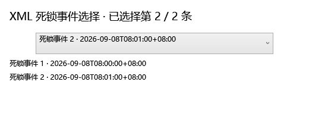

# IMP-06：统一最低限度的输入识别行为

> 后续实施：IMP-09 已完成共享能力、读取预算、取消结果、Partial 和 XEL 契约。本文保留 IMP-06 当时的边界；当前行为以 [IMP-09 说明](IMP-09统一文档读取与能力契约.md) 为准。

实施日期：2026-09-08。关联 R04、R05、D01、UI-02，依赖 IMP-02。基于工作区已有的 IMP-03～05 变更继续实施，未覆盖或提交这些改动。

同日完成审查后的四项修复：深层命名空间校验、严格 BOM 重试、事件源路径与显示名称分离、refactor 字节流入口统一。新增回归、官方依据及最新验证见 [IMP-06 审查修复与加固](IMP-06审查修复与加固说明.md)；下方首轮交付记录保留为历史证据。

## 行为与范围

| 输入 | 最低识别结果 | GUI / CLI 行为 |
| --- | --- | --- |
| 标准 ShowPlanXML + BatchSequence / Batch / Statements | ExecutionPlanXml / Success | GUI 打开；scan 继续执行规则与阈值检查 |
| 带前缀 ShowPlan、合法无 RelOp 语句、合法空 Statements 块 | Success | 不要求 QueryPlan 或 RelOp；规则仍使用根的实际命名空间 |
| `<notAPlan/>` 或无关 XML | Unrecognized / INPUT_UNRELATED_XML | 打开失败；scan Failed、退出码 1 |
| 非标准 ShowPlan 命名空间 | Unsupported / INPUT_PLAN_NAMESPACE | 不再接受仅含 `showplan` 的任意 URI |
| 缺失 Batch / Statements、错误子节点命名空间或未知语句种类 | Invalid / INPUT_PLAN_STRUCTURE | 不输出“零问题健康”或 Passed |
| 空内容、损坏 XML、禁止的 DTD | MalformedXml / INPUT_MALFORMED_XML | 明确失败；不输出原始解析异常中的输入片段 |
| 文件缺失、权限或读取失败 | ReadError / INPUT_READ_ERROR | 明确失败，不生成 DUMP |
| 裸 deadlock、deadlock-list、XE event/data/value、events / RingBufferTarget | DeadlockXml / Success | 返回所有事件；按事件选择或逐一输出 |
| 空死锁、缺少进程/资源结构、混合或损坏事件集合 | Invalid / INPUT_DEADLOCK_STRUCTURE | 整份拒绝，不静默跳过记录或仅取首条 |
| 合法死锁被交给 scan / refactor 计划入口 | Unsupported / INPUT_EXPECTED_PLAN | 类型仍为 DeadlockXml；说明该入口只接受计划 |
| 未知读取异常 | UnexpectedError / INPUT_UNEXPECTED_ERROR | 致命日志、DUMP 与异常记录；诊断失败也保持原操作失败 |

XML 内容是最终判定依据。GUI 对话框和拖放中的扩展名仅作路由提示，未知扩展名也进入内容识别。`.xel` 仍作为二进制 trace 路由给现有专用读取器；`DocumentOpenService` 对 XEL 的成功仅表示交给读取器，不等于二进制已解析成功。CLI scan 仍是计划扫描入口，目录枚举范围仍是 `.sqlplan`；桌面 CLI 的 XML 分析支持计划与死锁。

## 实现

- Core 新增 `InputRecognitionService`、`InputRecognitionResult`、`InputStatus` 与 `DeadlockInput`。文件经字节流和 `SafeXmlHelper` 读取，内存 XML 同样走 `SafeXmlHelper`；BOM 重试只使用实际 BOM 对应的严格解码器并复用同一流，不替换坏字节，不放宽 DTD / XmlResolver 限制。ShowPlan 深层命名空间校验保留标准 InternalInfo 的任意内容扩展点。
- `DocumentOpenService`、`SqlXmlAnalysisEngine`、独立 CLI scan、桌面 CLI 复用共享识别。GUI 显示同一错误代码与原因。
- `AnalysisReport` 增加 `IsSuccess`、`InputStatus`、`InputErrorCode` 和 `InputErrorMessage`。失败报告保留一条 Critical 输入诊断；`ApplicationOrchestrator` 在生成 SQL 候选前返回失败，继续兼容旧 `PARSE_ERROR` 适配器。
- scan 保留外层 `Passed/Failed` 和原退出码，JSON 新增输入状态、类型、错误代码；console / JSON / JUnit 均输出失败原因。规则本身的 ID、默认严重度和配置未改变；新 `INPUT_*` 是入口诊断，不是 `RULE_*` 性能规则。
- 显式指定却不存在的 refactor 辅助计划返回 `INPUT_READ_ERROR`，不再以空分析报告继续；未指定 `--plan` 时仍支持纯 SQL 重构。桌面 CLI 批处理将无效文档计入失败数并保留非零退出码，WPF `Shutdown` 透传该退出码。
- `DeadlockInput` 返回源顺序的一基序号、原始时间字符串和独立死锁 XML 副本。仅对副本规范化元素命名空间，源 XDocument 不修改。
- GUI 复用现有死锁事件下拉框，显示全部 XML 事件并允许切换，打开其他文档时清除旧列表。桌面 CLI 按顺序输出每个事件，带事件标题。底层图解析器、时间线和单事件分析服务对未选择的多事件文档返回 `INPUT_EVENT_SELECTION_REQUIRED`。

## 异常、DUMP 与日志

复用 IMP-04 已有 `ExceptionPolicy` / `UnexpectedErrorReporter` / `WindowsMiniDumpWriter`，不另建日志或 DUMP 系统。

| 构建 | 日志输出 |
| --- | --- |
| Debug | DEBUG（含旧 Info/Verbose 调用）、WARN、ERROR、CRITICAL |
| Release | 仅 ERROR、CRITICAL；运行参数不能开启低级别日志 |

日志同时写 stderr 与文件，stdout 留给结果文档。新增识别日志记录操作、类型、事件数或稳定错误代码，不记录 SQL / XML 正文。生产默认目录为 `%LOCALAPPDATA%\SqlXmlAnalyzer\log`。

未知异常生成真实 Windows minidump `process.dmp`，并保存 `exception.json`（时间、操作、进程、托管异常与堆栈）。默认目录 `%LOCALAPPDATA%\SqlXmlAnalyzer\dumps`，无法使用时回退 `%TEMP%\SqlXmlAnalyzer\dumps`；同一异常实例只捕获一次。验证 DUMP 头与流信息后才声明已生成。写入失败时保留可用的异常记录并明确显示 `DUMP 生成失败`，不将失败转换成成功。诊断文件使用既有私有目录访问控制。

格式、类型、结构、权限和 I/O 错误不触发 DUMP。用户取消继续抛出 `OperationCanceledException`，由 GUI 当前会话处理，不当作未知崩溃。

## 单元测试与夹具

新增 `InputRecognitionTests` 与 `DeadlockEventSelectionTests`，更新旧 `DocumentOpenServiceTests` 中曾允许 Unknown 成功、伪命名空间和缺少结构的断言。覆盖：

1. GUI 服务 / Analysis / CLI 三入口失败代码与状态一致；无关 XML、错 namespace、缺少结构、错层级、DTD 和格式损坏。
2. 前缀和无 RelOp 计划识别；前缀计划仍触发扫描与成本检查；批量扫描坏文件失败后继续处理好文件。
3. console / JSON / JUnit 非成功输出；refactor 辅助计划无效时 dry-run 与写回模式均不生成候选、不改源文件、不生成备份。
4. 包装、多事件、带 namespace、选择第二条后图和时间线进程归属一致；清除旧选择；原文不变；混合记录整份拒绝。
5. 已知读取错误、取消、真实 Windows DUMP、跨入口同一异常去重、DUMP 写入失败、BOM 编码兼容。
6. 复用现有 `DiagnosticLoggingTests`，分别在 Debug / Release 检验日志文件与 stderr 的级别策略及原生 DUMP 格式。

两个无 RelOp 正向夹具通过固定的[微软 ShowPlan XSD](https://schemas.microsoft.com/sqlserver/2004/07/showplan/sql2019/showplanxml.xsd)全量验证。它们是人工构造并经 XSD 验证的结构样例，不声称来自真实 SQL Server 采集；未执行 SQL。Schema 原文、SHA-256 和夹具来源见[来源记录](../SqlXmlAnalyzer.Tests/TestData/Schemas/README.md)。测试离线读取嵌入的 XSD，不访问网络。

## 首轮交付验证记录

最终新增 **46 项**回归；Debug / Release 各 **1011 / 1011** 测试通过，0 失败、0 跳过；全量非增量构建均 0 警告、0 错误。两配置的 42 项验收工具回归全部通过，受保护输入漂移均为空。v2.5 收紧 R04 的非成功状态/错误代码一致性，R05 增加集合、选择第二条与拒绝未选择集合的检查；未放宽其他验收条件。

| 配置 | 全量证据 | 真实 CLI 输出 |
| --- | --- | --- |
| Debug | [摘要](acceptance/IMP-02/runs/20260908T115707647Z_c5b1e0766cfc_9da94257/summary.json)、[构建](acceptance/IMP-02/runs/20260908T115707647Z_c5b1e0766cfc_9da94257/build.stdout.txt)、[TRX](acceptance/IMP-02/runs/20260908T115707647Z_c5b1e0766cfc_9da94257/test-output/existing-suite.trx) | [stdout](acceptance/IMP-02/runs/20260908T115707647Z_c5b1e0766cfc_9da94257/cli-invalid-input.stdout.txt)、[stderr](acceptance/IMP-02/runs/20260908T115707647Z_c5b1e0766cfc_9da94257/cli-invalid-input.stderr.txt) |
| Release | [摘要](acceptance/IMP-02/runs/20260908T115743976Z_c5b1e0766cfc_2ce6d6ae/summary.json)、[构建](acceptance/IMP-02/runs/20260908T115743976Z_c5b1e0766cfc_2ce6d6ae/build.stdout.txt)、[TRX](acceptance/IMP-02/runs/20260908T115743976Z_c5b1e0766cfc_2ce6d6ae/test-output/existing-suite.trx) | [stdout](acceptance/IMP-02/runs/20260908T115743976Z_c5b1e0766cfc_2ce6d6ae/cli-invalid-input.stdout.txt)、[stderr](acceptance/IMP-02/runs/20260908T115743976Z_c5b1e0766cfc_2ce6d6ae/cli-invalid-input.stderr.txt) |

R04 / R05 均为 `ProbeConditionMet`。全矩阵为 **7 最低条件通过、15 NotMet、0 探针执行失败**；因此矩阵运行器按约定退出 1，不能解读为全部改善工作已完成。原问题自动关闭数仍为 0，数据库执行与覆盖率报告均未进行。两种构建的日志策略及真实 DUMP 已由全套诊断测试验证；Release 的真实无效输入进程 stderr 只有 ERROR 日志。

`<notAPlan/>` 的实际 scan 输出关键字段如下，进程退出码为 1：

```json
{
  "Status": "Failed",
  "InputStatus": "Unrecognized",
  "InputKind": "Unknown",
  "InputErrorCode": "INPUT_UNRELATED_XML"
}
```

选择器组件离屏渲染（测试选中第二条，非完整应用截图）：



统一验证摘要与构建环境见 [verification.json](implementation/IMP-06/20260908T115018335Z/verification.json)。默认 `obj/Debug` 的 WPF 资源曾被 Google Drive（PID 25208）锁定；未停止同步进程。系统临时输出目录能构建，但四项既有治理测试依赖从测试目录向上找到仓库，故最终使用仓库 `bin/imp06-verification-d9988486ac9f45e48dae67fb2fb2a747` 中的独立产物目录。该路径只包含生成文件，没有修改项目构建配置。系统临时布局的失败记录、桌面 CLI 子进程编码回归首次失败记录均保留在历史运行目录，后者已通过显式 UTF-8 输出修正；以本节最终两次运行作为交付证据。

在 PowerShell 中重现最终布局与完整检查：

```powershell
$env:UseArtifactsOutput = 'true'
$env:ArtifactsPath = Join-Path (Get-Location) ('bin/imp06-verification-' + [guid]::NewGuid().ToString('N'))
pwsh -NoProfile -File DOCS/acceptance/IMP-02/Run-AcceptanceMatrix.ps1 -RepositoryPath E:/SqlXmlAnalyzer -Configuration Debug
pwsh -NoProfile -File DOCS/acceptance/IMP-02/Run-AcceptanceMatrix.ps1 -RepositoryPath E:/SqlXmlAnalyzer -Configuration Release
Remove-Item Env:UseArtifactsOutput, Env:ArtifactsPath
```

若不受同步锁影响，可使用常规 `dotnet build SqlXmlAnalyzer.sln` 和 `dotnet test SqlXmlAnalyzer.Tests/SqlXmlAnalyzer.Tests.csproj`。矩阵退出码 1 的解释仍以各次 `summary.json` 中的 NotMet 为准，不跳过或豁免失败断言。

## 本阶段限制

- 这是最低识别，不是所有 ShowPlan 版本、字段或语句内部结构的完整 XSD 验证。合法输入通过识别不等于性能健康；scan 后续仍运行原规则。
- XML 混合/损坏集合整份失败，未实现 Partial；完整预算、取消结果枚举、能力标记、原始位置与未解释字段保留继续由 IMP-09 完成。
- XEL 完整契约、事件与文档会话保存/恢复、跨页上下文继续由 IMP-09 / IMP-20 处理。
- 正式控件的 STA 事件切换测试和离屏渲染仅覆盖本次选择器行为，不代替完整 WPF DPI / 主题 / 全应用操作验收。R04 / R05 的最低条件通过不表示整项原始问题已完成所有后续验收。
