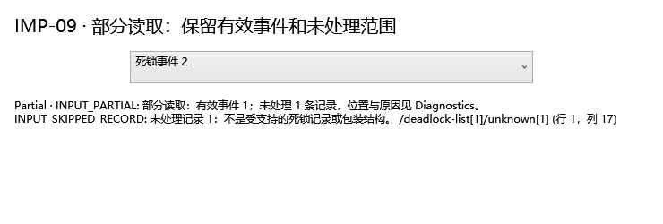

# IMP-09：统一文档读取与能力契约

实施日期：2026-09-08。范围：Core 读取服务、SafeXmlHelper、XEL、GUI 打开/事件选择、Analysis/Application 适配、两种 CLI。继承 IMP-06 的最低结构识别，未新增规则 ID 或改变规则严重级别。

同日完成[审查修复与加固](IMP-09审查修复与加固说明.md)：修复同级节点定位的二次增长与取消、空 XE 载荷遗漏、CLI 取消令牌断链和长 XML 编码声明截断。新增 20 项回归，Debug/Release 全量测试各 1247 项通过；下文初次实施证据保留，最新证据见加固说明。

2026-09-09 [IMP-09 至 IMP-13 联合审查修复](IMP-09至13联合审查修复与加固说明.md)进一步统一空语句容器与扩展内容的能力口径，并在清空结果时释放两个输入引用及其原始快照。最新 Debug/Release 全量测试各 1579 项通过。

## 1. 共享接口与结果

`InputRecognitionService` 实现 `IDiagnosticDocumentReader`：

```csharp
Task<InputRecognitionResult> ReadAsync(Stream stream, DocumentReadOptions? options = null,
    CancellationToken cancellationToken = default, string? sourceName = null);
Task<InputRecognitionResult> ReadFileAsync(string path, DocumentReadOptions? options = null,
    CancellationToken cancellationToken = default);
```

XML 支持不可定位流、短读取和读取过程取消。流归调用方所有，文件入口负责释放自己打开的流；`sourceName` 为 `.xel` 时流入口使用 XEL 解码器。XML 根据内容识别，`.xel` 为二进制候选提示，必须实际读取成功，不能只按扩展名返回成功。

为兼容既有调用方，保留同步 `Load` / `Parse` 及其 XML 取消抛异常行为；新的异步契约和 GUI 返回 `Cancelled`。`DocumentOpenResult.Input` 保留完整共享结果。`AnalysisReport` 携带 `InputEnvelope`、`Capabilities` 和 `InputDiagnostics`，`IAnalysisEngine.AnalyzeInput` 让编排层传递已读取的来源信息。

| 状态 | 语义 | 是否可分析 |
| --- | --- | --- |
| Success | 支持的结构已读取，无跳过记录 | 是；仍不保证通过完整 XSD 或所有领域语义校验 |
| Partial | 集合中至少一条有效死锁，同时存在未处理记录 | 只能显式选择有效事件；整体不是成功 |
| Invalid | 根/必要结构无效、无有效死锁或 XEL 内容损坏 | 否 |
| Unsupported | 不支持的 ShowPlan 命名空间，或 XEL 没有死锁事件 | 否 |
| Unrecognized | 保留 IMP-06 的无关 XML 状态 | 否 |
| MalformedXml | XML 不完整、语法错误、禁止的 DTD | 否；不从破损 XML 猜测可恢复事件 |
| TooLarge | 任一读取预算超限 | 否；不提交已收集的事件 |
| Cancelled | 调用方取消 | 否；不提交文档/事件 |
| ReadError | 文件/流读取、权限或严格解码失败 | 否 |
| UnexpectedError | 非预期实现或组件异常 | 否；通过已有诊断组件生成 DUMP |

`IsSuccess` 仅对 Success 为 true；`HasUsableContent` 对 Success/Partial 为 true。消费者不得把空 Issues、可解析 XML 或 Partial 当作“无问题”。错误仍使用稳定 `INPUT_*` 代码；新增主要代码为 `INPUT_PARTIAL`、`INPUT_TOO_LARGE`、`INPUT_CANCELLED`、`INPUT_INVALID_XEL`、`INPUT_XEL_NO_DEADLOCK`、`INPUT_XEL_INVALID_EVENTS`。

## 2. 来源与能力

`DocumentEnvelope` 包含 DocumentId、SourceHash、SourceName、DetectedKind、CapturedAt、EngineBuild、SchemaVersion、SourceBytes。

- 文件/流先读取受预算约束的单份字节快照。SHA-256 和解码消费同一快照；`SourceSnapshot` 保留原始字节，包括 BOM。相同字节生成相同 DocumentId，不受显示文件名影响。
- 内存字符串/已解析 XDocument 没有可验证的原始文件字节，因此 SourceHash/SourceBytes 为 null，DocumentId 为本次读取的标识。
- 引擎 Build/Version 只从 ShowPlan 根属性读取。没有输入证据时不补造版本或采集时间。原始时间字符串保留；只有带 `Z` 或 `±HH:mm` 的时间才能成为 `DateTimeOffset`。多事件文档不虚构统一采集时刻。
- `SourceLocation` 使用包含命名空间展开名、同名兄弟序号的 XML 路径及原始行/列。路径用于定位，不是可直接执行的 XPath。XEL 另记录源事件序号、起始字节和长度，不虚构二进制文件的行号。
- `DeadlockInput.Index` 保留源序号，包括跳过记录造成的空缺；同一 XEL 事件内多个死锁另以 PayloadIndex 和 XML 路径区分，标签显示子事件序号。原始 XML 文档、未知元素/属性及 `OriginalElement` 留存，供后续模型解释。给旧解析器的规范化副本与源文档分开。
- XEL 保留每条 `XelInputRecord` 的字段/Action 展示值、时间和字节位置，包括不支持的事件；完整原始快照是二进制未知字段的无损依据。诊断不默认输出这些原始字段。

能力为“观察到可供消费的内容”，不代表数据完整性或性能结论：

| 能力 | 依据 |
| --- | --- |
| PlanStatements | 通过最低 ShowPlan 结构识别，包括合法空 Statements/无 RelOp 语句 |
| PlanOperators | 存在标准命名空间、归属已识别语句 QueryPlan 的 RelOp；忽略 InternalInfo 和外部命名空间子树 |
| RuntimeCounters | 属于算子的直接 RunTimeInformation/RunTimeCountersPerThread 路径；不保证每线程/每算子的计数都完整或有效 |
| DeadlockGraph | 至少一条通过最低结构校验的死锁 |
| MultipleEvents | 返回多条可用死锁 |
| OffsetTimestamps | 至少一条事件含可证明时区的时间 |
| PreservedSource | 保留原始 XML 或 XEL 来源信息 |

读取和默认诊断入口共享 `PlanCapabilityService`；按 XML 根缓存，树修改后失效。明确传入的能力快照保持调用方约束；旧读取/报告结果不随 XML 修改而改变，需要重新读取/分析。`ClearResults()` 同时清空 `CurrentPlanInput` / `CurrentDeadlockInput`，解除原始字节及完整事件记录的引用，生产代码不强制 GC。

## 3. 预算及测量依据

在修改默认值前测量了仓库当前 10 个 `.sqlplan/.xdl` 样例：最大文件 1473 字节、最大字符数 1473、最大 XML 深度 11。可复现脚本和各样例明细见 [测量脚本](implementation/IMP-09/Measure-InputSamples.ps1)、[测量数据](implementation/IMP-09/input-samples.json)。这些是小型回归夹具，并非生产容量基准；没有真实二进制 XEL 正向样本可用于事件数容量标定。

采用下列留有余量的初始保护上限，而非声称这些值是已测得的安全容量或吞吐保证。后续生产样例/性能基准可以显式调整：

| 选项 | 默认 | 计数范围 |
| --- | --- | --- |
| MaxBytes | 67108864（64 MiB） | 原始输入快照字节；读取最多多探测 1 字节以判断超限 |
| MaxXmlCharacters | 33554432 | 解码后的 UTF-16 代码单元；XEL 对所有死锁 XML 载荷累计 |
| MaxDepth | 128 | XMLReader 深度 + 1，根为 1；在构建节点前检查 |
| MaxNodes | 1000000 | XMLReader 读取节点（含空白/结束节点）加属性数；XEL 对载荷保守累计计数 |
| MaxXelEvents | 10000 | 所有 XEL 事件，包含不相关和损坏载荷的事件 |

预算必须为正，MaxBytes 不大于 Int32.MaxValue。XML 字符和字节上限在 XML 树分配前检查；XML 深度/节点上限在流式 XmlReader 读取时检查。`SafeXmlHelper` 的原有入口也使用默认预算；DTD 仍为 Prohibit，XmlResolver 仍为 null。

GUI 宿主可通过 `new DocumentOpenService(new InputRecognitionService(options: options))` 注入配置；本步没有新增 GUI 配置编辑器。CLI 的 scan、read、refactor 辅助计划支持：

```json
{
  "MaxBytes": 67108864,
  "MaxXmlCharacters": 33554432,
  "MaxDepth": 128,
  "MaxNodes": 1000000,
  "MaxXelEvents": 10000
}
```

```powershell
dotnet run --project SqlXmlAnalyzer.CLI -- read capture.xel --read-options limits.json
dotnet run --project SqlXmlAnalyzer.CLI -- --path plans --format json --read-options limits.json
dotnet run --project SqlXmlAnalyzer.CLI -- refactor query.sql --plan query.sqlplan --dry-run --read-options limits.json
```

选项文件最多 64 KiB；未知字段、无效 JSON 或非正数返回 `INPUT_OPTIONS_INVALID` 和退出码 2。字符串输入没有物理字节来源，只受 XML 相关预算约束。读取为受限快照模式，不是无限文件大小的增量分析。

## 4. Partial 与入口行为

XML 集合以完整且安全的 XML 树为前提，逐记录验证。有效事件保留；每个不支持/损坏结构的记录写入 Diagnostics（代码、原因、原位置、源序号），原记录仍在源文档中。XEL 对各事件载荷执行相同识别，保留无法解释的载荷和事件信息。整体 XML 语法损坏、XEL 文件损坏、超限或取消时不发布之前收集的事件。

GUI 对 Partial 显示未处理范围，并允许从现有选择器选择有效事件；选择器保留完整读取结果，悬停可查看范围，打开下一文档时清除旧选择器状态。文件打开、拖拽和 XEL 入口统一经过 DocumentOpenService。ViewModel 保留计划/死锁读取结果，选择事件不会覆盖源文件路径。

独立 CLI 新增 `read`：输出状态、来源、能力、诊断和事件定位的 JSON；其用途是检查读取契约。scan 保持执行计划专用语义，新增 InputEnvelope、Capabilities、InputDiagnostics。桌面 CLI 分析每个有效死锁，Partial 的文本/导出报告包含未处理范围并返回失败。批量任务单文件失败后继续处理后续文件，取消则停止。

退出码：Success 为 0；Partial/输入失败为 1；选项错误为 2；独立 CLI 用户取消为 130。Ctrl+C 在读取/分析检查点生效；既有规则内部仍采用其原有执行方式。refactor 辅助计划不是 Success 时，在重构与写回前终止。

## 5. 异常、DUMP 与日志

复用 `ExceptionPolicy`、`UnexpectedErrorReporter`、`WindowsMiniDumpWriter`，不创建第二套故障记录系统。未知读取/流组件异常生成经过 `MinidumpValidator` 校验的 Windows `.dmp` 和 `exception.json` 侧车；同一异常对象跨边界去重。转储失败时仍返回原 Unknown/UnexpectedError 语义并明确显示失败，诊断提供者再抛异常也不会替代原输入失败。

正常超限、XML/XEL 格式错误、文件权限/读取错误、用户取消不生成 DUMP。原始输入内容不作为新读取日志的调试字段；公开解析错误使用固定文字，避免把解析器回显的 SQL/XML 带入日志。

| 构建 | 记录等级 |
| --- | --- |
| Debug | DEBUG、WARN、ERROR、CRITICAL（致命） |
| Release | ERROR、CRITICAL；不能通过 verbose 参数启用 DEBUG/WARN |

日志写到 stderr 和 `%LOCALAPPDATA%\SqlXmlAnalyzer\log`，stdout 留给 CLI 结果。DUMP 默认 `%LOCALAPPDATA%\SqlXmlAnalyzer\dumps`，失败回退 `%TEMP%\SqlXmlAnalyzer\dumps`；详情沿用 [IMP-04 诊断约定](IMP-04高风险改写限制与诊断说明.md)。DUMP/原始快照含进程或输入数据，不能作为脱敏输出。

## 6. 验证与后续边界

最终 Debug / Release 完整解决方案构建均为 **0 警告、0 错误**；完整测试各 **1227 通过、0 失败、0 跳过**，相较本步开始的 1183 项新增 44 项。结果见 [verification.json](implementation/IMP-09/verification.json)、[Debug TRX](implementation/IMP-09/final/debug-verified.trx)、[Release TRX](implementation/IMP-09/final/release-verified.trx)、[Debug 构建](implementation/IMP-09/final/build-debug.log)、[Release 构建](implementation/IMP-09/final/build-release.log)。

[CLI read 实际输出](implementation/IMP-09/final/cli-read.json)及[退出码](implementation/IMP-09/final/cli-read-exit.json)来自真实 CLI 进程。下图为有效事件 2 的选择器和未处理事件 1 的范围展示：



环境记录：最终重建曾遇到 WPF 生成的 `.g.resources` 文件占用，删除该单个生成文件后成功重建；旧截图/结果文件也无法覆盖，因此最终证据使用独立 `final` 目录。没有删除源码、修改测试断言来绕过环境错误，或中断用户应用。

新增测试覆盖四类 XML 预算与精确边界、不可定位/短读流、取消、来源哈希、时区与未知字段、无 RelOp 能力、Partial 跳过位置、DTD、未知错误真实 DUMP、DUMP 组件失败、两种日志模式、XEL 全事件/累计预算及损坏二进制、CLI JSON/预算/退出/批量继续/禁止写回、真实 STA WPF 选择器状态。已有全量测试一并运行。

XEL 成功和混合事件通过可注入 `IXelEventSource` 验证；实际 XELite 解码器覆盖损坏二进制输入。目前没有生产 XEL 正向文件或连接 SQL Server 的验证，不能把这些测试表述为全版本二进制兼容性证明。WPF 截图为真实控件的 STA 渲染，非完整窗口端到端自动化。

[IMP-10 的完整语句/算子/对象身份与适配器](IMP-10语句算子与对象身份.md)现已完成。IMP-20 的多事件会话保存恢复、IMP-26 的大文件性能和 GUI 长任务优化、IMP-29 的广泛兼容验收仍按各自范围推进。捕获能力表示可读取证据，不替代运行指标完整性判定。本步不宣称关闭全部 D01/R04/R05/UI-02/UI-08 问题。
