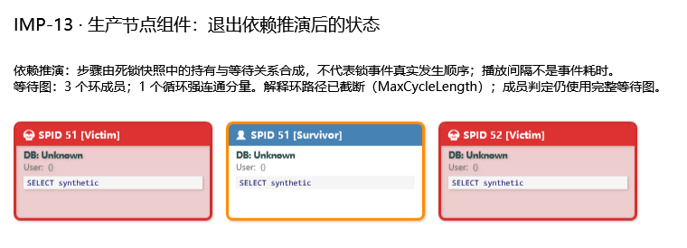

# IMP-13：统一死锁图、环与诊断依据

实施日期：2026-09-09。状态：本步范围已完成。依赖 IMP-09/12；对应 R06/R07/R08/R18/R22、D04/D05、UI-04。

后续四项审查问题及相关加固已完成，新增 17 项测试；最新全量验证各 1541 项通过，见[审查修复与加固说明](IMP-13审查修复与加固说明.md)。下文验证数量和原附件保留初次实施的历史基线。

主图、依赖推演、诊断和报告现在使用同一份等待关系与强连通分量结果。修复重叠环遗漏成员、同一环随起点重复计数、跨循环分量的桥接资源误标为环内资源，以及多受害者被按第一位受害者处理的问题。

## 共享数据与来源

`DeadlockAnalysisService` 每次分析只调用一次 `DeadlockXmlParser`，随后构建共享 `DeadlockGraph`。`DeadlockTimelineParser.FromGraph` 直接投影该图，不重新解析 XML，也不再运行自己的 DFS。独立的 `ParseResult(string)` 入口仍经 `SafeXmlHelper`、同一解析器和图构建器执行。

| 数据 | 保留和解释方式 |
| --- | --- |
| 进程与执行帧 | 既有强类型字段、原始属性 `RawFields`、`RawXml`、XML 来源位置；显示层对 unknown 帧的替换不影响保留原文 |
| 资源 | 兼容内部编号 `res_0` 等；`SourceId` 是原始 id，`ResourceKey` 基于资源类型、属性、关系和重复出现序号生成，避免相同对象名或重复 SourceId 合并资源 |
| owner/waiter | 保存全部原始属性和位置；`ResourceLinks` 提供进程、资源、角色、mode、requestType、原始属性及稳定 LinkId |
| 等待边 | waiter→owner，每条边持有资源、请求/持有模式、两个 LinkId 和 EdgeId |
| 受害者 | `VictimProcessIds` 保存整个 victim-list；兼容单值 `VictimProcessId` 为按序号字符串排序的首项，界面和推演读取集合 |
| 环成员 | `CycleAnalysis` 发布只读强连通分量及冻结的进程、等待边、资源关系集合 |
| 来源标识 | 图与诊断保留选定事件的 SourceFingerprint；来源路径指向选定事件的 XML。该指纹基于序列化后的事件内容，不等同于原文件字节哈希 |

Exchange/SyncPoint 不再降为对象名；WaitType、nodeId、ownerActivity、waiterActivity 等可用属性原样保留。未知关系端点保留在资源原文并产生警告，不创建虚构进程。重复进程 id 是明确输入错误；缺失受害者与悬空 victim id 可见。相同进程同时出现在 owner/waiter 中，保留关系但不据此证明自阻塞。

原始 XML 保留的是 XML 内容表达，非文件编码或字节布局。旧公开图列表仍兼容可变 API；生产路径在完成构建后只读取这些列表，不应在分析结束后自行修改图、再复用旧的环分析结果。

## 环成员、解释路径与预算

迭代式 Kosaraju 算法在完整等待图上计算强连通分量，不使用递归。两个端点必须位于同一个循环分量，边及其 owner/waiter 关系才属于环；连接两个循环分量的单向桥不属于环。

解释路径单独按最小进程编号选起点。规范化先删除末尾重复的闭合节点，再旋转进程和边；路径身份包含 EdgeId，因此相同进程路径经过不同资源时仍可区分。环方向不反转合并。

`DeadlockGraphOptions` 默认预算：

| 参数 | 默认值 | 到达限制后的行为 |
| --- | ---: | --- |
| MaxResourceLinks | 200,000 | 超过有效 owner/waiter 关系数量时，输入预算失败，不返回部分图冒充完整图 |
| MaxWaitForEdges | 100,000 | 限制 owner×waiter 候选组合，包含会被排除的自关系；超过即失败 |
| MaxCyclePaths | 64 | 发现额外解释环时停止枚举，标记路径截断 |
| MaxCycleLength | 128 | 超出允许长度的搜索分支停止，标记路径截断 |
| MaxCycleSearchSteps | 100,000 | 限制解释搜索考察的边数；达到预算仍需继续搜索时停止并标记截断 |

路径截断不会改变完整图上的环成员。即使路径集合为空，只要 SCC 确认存在循环成员，界面仍显示这些成员。主图说明、推演固定提示、Mermaid、ASCII 与报告均显示截断原因。环路径数是已枚举解释的数量，不应把它当作截断情况下的总环数。读取 XML 的 IMP-09 预算继续生效。

## 诊断依据与行为变化

每个 `DeadlockPattern` 具有 RuleId、版本 1.0.0、SourceFingerprint、Confidence、Evidence、Limitations、EvidenceTruncated。证据包含进程/资源/关系身份和 XML 来源；展示最多 64 项，超出明确说明，完整事实仍在共享图中。`DeadlockDiagnosticFormatter` 用于选中详情、HTML、便携报告及桌面 CLI `--analyze` 的文本输出。

| 规则 | 证据和结论边界 |
| --- | --- |
| RULE_DEADLOCK_PARALLEL | 当前图中正数 ECID、同 SPID 多上下文，或 Exchange/SyncPoint 资源；不再扫描额外 XML 猜测并行，也不直接要求 MAXDOP=1 |
| RULE_DEADLOCK_CONVERSION | 实际 S/U 与 X/U 模式组合，作为转换候选；不能仅由不同进程模式证明同一事务发生转换 |
| RULE_DEADLOCK_LOOKUP | 对象/索引资源及 SQL 文本线索，回表是待验证假设；需实际计划验证 |
| RULE_DEADLOCK_RANGE | 仅实际捕获的 RangeS-S、RangeS-U、RangeI-N、RangeX-X、RangeI-S、RangeI-U、RangeI-X、RangeX-S、RangeX-U；支持 owner、waiter、resource mode；SERIALIZABLE 或 RangeBogus 不构成证据 |
| RULE_DEADLOCK_PAGE | PAGE/RID 与写入文本线索；不能由页面资源证明页拆分 |
| RULE_DEADLOCK_CASCADE | 外键/约束/级联文本线索；不能单凭关键词确认参与环 |
| RULE_DEADLOCK_HOTSPOT | 同一资源的多 waiter 快照；不据此断言持续热点 |
| RULE_DEADLOCK_PRIORITY | 捕获优先级及 logused；最终受害者始终来自 victim-list，优先级调整不等于消除死锁 |
| RULE_DEADLOCK_CHAIN | 共享图的 waiter→owner 边与 SCC 摘要；不再错误冠名为 sp_BlitzLock 输出 |
| RULE_DEADLOCK_CYCLE | 无其他诊断时提供图摘要；空图或未确认循环时不虚构 Cyclic Deadlock |

Range、等待链和图摘要的置信度表示观测/图计算依据较强；其他启发式为 Low，均不表示根因已确诊。当前诊断保持统一 Medium 展示等级；并行事件不再提前终止其他证据检查，诊断数量和类型名称可能较旧版变化。此处是死锁模式分析规则，未修改执行计划的 `RuleConfiguration.json` 或新增 CLI 命令。独立 CLI `read` 仍保留 IMP-09 的原始输入读取协议。

## 界面与报告

- WPF 主图保留全部线程和资源；环成员由共享 SCC 标记，边及提示可关联证据编号。
- 推演步骤由捕获关系合成，固定显示“不是实际发生顺序、播放间隔不是事件耗时”。受害者分别在自己的步骤揭示；退出推演后保留全部受害者和环成员样式。
- `CurrentDeadlockAnalysis` 保存完成结果；GUI HTML 导出复用它，保留原分析的自定义预算和截断状态。独立报告入口通过同一服务构建结果。
- 选中资源详情显示 SourceId、ResourceKey、来源和原始资源 XML，便于查看 Exchange/SyncPoint 属性。

生产节点组件渲染（合成样例、MaxCycleLength=1，两位受害者；不是完整应用窗口截图）：



## 异常与日志

`DeadlockAnalysisService`、图构建及独立解析入口沿用 `ExceptionPolicy`。格式不合法、读取预算、IO 等预期故障明确失败；取消令牌向图遍历和推演投影传递，取消不生成 DUMP。未知异常调用 `UnexpectedErrorReporter`，记录 CRITICAL，使用既有串行化、专用线程 Windows MiniDump 写入器生成真实 `.dmp` 与 `.exception.json`；同一异常实例去重。写入器或诊断组件故障不替换原异常，失败原因进入错误日志。

默认 DUMP 目录为 `%LOCALAPPDATA%\SqlXmlAnalyzer\dumps`，不可用时回退 `%TEMP%\SqlXmlAnalyzer\dumps`。未知错误原异常继续传播，不返回伪成功图。DUMP 是进程诊断材料，未放入仓库验证附件；测试验证后清理临时故障材料。

Debug 记录 DEBUG、WARN、ERROR、CRITICAL；Release 仅 ERROR、CRITICAL，verbose 参数不能放开低等级。新增正常路径日志只输出操作和计数，SQL、对象名及未知进程 id 保留在分析结果，不额外写入正常路径日志。

## 验证与验收结果

新增 **43 项**自动化测试；既有 5 项模式测试按新的证据边界调整断言。Debug/Release 完整解决方案构建各 **0 警告、0 错误**；完整套件各 **1524 通过、0 失败、0 跳过**。

覆盖：重叠 a→b、b→a、a→c、c→b 的三个成员一致；两节点环去重；不同资源路径保留；进程/资源/owner 顺序变化；3 节点全部 63 个非空有向图与独立可达性闭包交叉验证；跨分量桥；路径数量/长度/步数预算；10,000 节点长环无递归；Exchange/SyncPoint 原字段与来源；多受害者；缺失端点/重复进程/自关系；实际 Range 模式；诊断证据截断；HTML 复用；真实 DUMP、DUMP 失败、诊断组件失败、取消、日志过滤及生产 WPF 节点状态。

复现命令：

```powershell
.\DOCS\implementation\IMP-13\Verify-IMP13.ps1
```

附件：[验证摘要与源码指纹](implementation/IMP-13/verification.json)、[Debug TRX](implementation/IMP-13/debug.trx)、[Release TRX](implementation/IMP-13/release.trx)、[构建与测试脚本](implementation/IMP-13/Verify-IMP13.ps1)、[合成混合资源样例](../SqlXmlAnalyzer.Tests/TestData/imp13_overlapping_deadlock.xdl)。

未连接真实 SQL Server 复现并发事务，未生成覆盖率报告，也未执行完整窗口交互验收。本步关闭 R08/R18 的上述最小反例；真实工作负载和完整界面验收仍随 IMP-20/22 推进。

## 官方依据

- [Microsoft：Deadlocks guide](https://learn.microsoft.com/en-us/sql/relational-databases/sql-server-deadlocks-guide?view=sql-server-ver17)：循环依赖、victim/process/resource 结构及并行交换资源。用于约束共享等待图与并行诊断表述。
- [Microsoft：Transaction locking and row versioning guide](https://learn.microsoft.com/en-us/sql/relational-databases/sql-server-transaction-locking-and-row-versioning-guide?view=sql-server-ver17)：键范围锁和转换模式。用于限制 Range 诊断到实际模式证据。
- [Microsoft：MiniDumpWriteDump](https://learn.microsoft.com/en-us/windows/win32/api/minidumpapiset/nf-minidumpapiset-minidumpwritedump)：DUMP 写入与线程安全约束，继续使用既有诊断基础设施。

三页均于 2026-09-09 直接 HTTPS 读取成功，见[检索记录](implementation/IMP-13/sources.json)。SCC 与预算算法是本项目实现选择，不声称来自 Microsoft 诊断规则。
