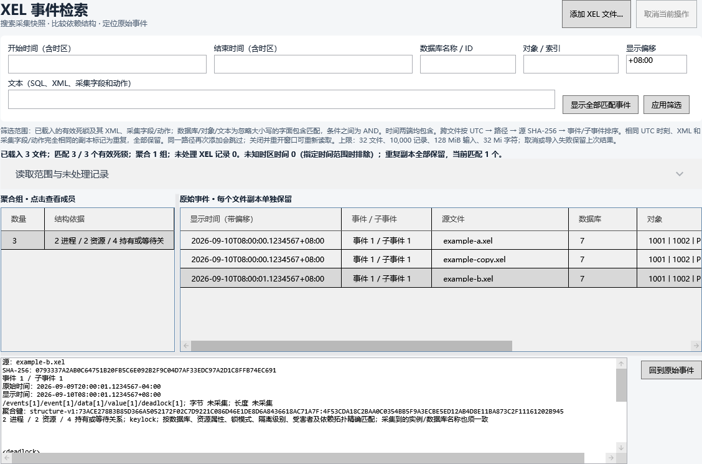
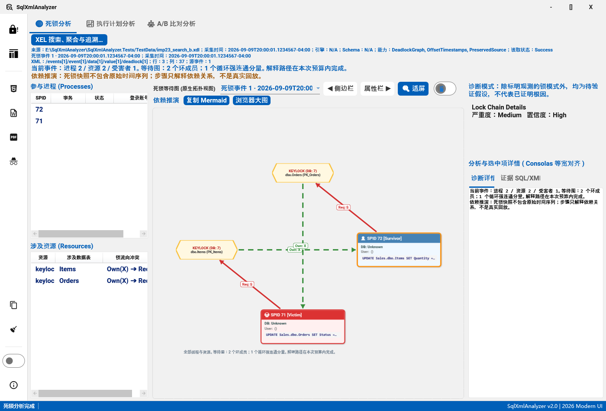

# IMP-23：XEL 搜索、聚合与事件追溯

实施日期：2026-09-10。对应 UI-11，复用 IMP-09 的输入快照、IMP-13 的死锁分析和 IMP-20 的事件选择。初版 45 项回归，本轮[审查修复与加固](IMP-23审查修复与加固说明.md)新增 21 项；Debug/Release 全量各 2480 通过，真实 XEL、内存与 WPF 宿主复验通过。待实施范围为 IMP-24–IMP-30。

## 入口和筛选范围

死锁工作区点击 **XEL 搜索、聚合与追溯…**，自动载入当前 XEL/XML 死锁输入；也可从空工作区打开，再多选添加 `.xel` 文件。窗口保留自己的输入快照，切换主工作区不会更换检索集合。首次载入完成前禁用筛选和添加；同一路径重复添加会跳过，路径不同的相同文件保留为独立副本。当前输入沿用主窗口快照；文件更新时先关闭检索窗口、在主窗口重新打开文件，再检索并重新添加额外来源。

| 条件 | 口径 |
| --- | --- |
| 开始、结束时间 | 必须带 Z 或 ±HH:mm；两端包含，按 UTC 比较到 .NET tick（100 ns），空白表示不限。 |
| 数据库 | XML 的 currentdbname、currentdb、dbid 等数据库 ID/名称，以及采集字段/动作中的 database_name、database_id 等；缺失名称不反查服务器。 |
| 对象 | objectname、object_name、object_id、objid、indexname、hobtid、associatedObjectId 等原始值。 |
| 文本 | 有效死锁 XML、SQL、记录名称及字段/动作，包括未知字段；字面包含匹配，不执行正则或 SQL。 |
| 显示偏移 | 固定 ±HH:mm，范围 -14:00～+14:00，不覆盖原始时间；不推测机器时区或命名时区的夏令时规则。 |

数据库、对象、文本采用 OrdinalIgnoreCase 包含匹配，多个条件按 AND 组合。没有带时区时间的事件默认排在最后；指定时间条件后排除，并在摘要列出数量。日期转换越界时显示说明，原始时间仍保留。夏令时重复小时须输入对应时刻的明确偏移。

搜索/聚合只覆盖已成功提取的死锁及其采集信息。非死锁、缺少 xml_report、无效 XML 等未处理记录不参与；状态、数量及位置保留在“读取范围与未处理记录”。Partial 不表示文件已完整分析。

可解码但不含死锁的 XEL（`INPUT_XEL_NO_DEADLOCK`）保留为零事件来源，不中断同批滚动文件的导入，仍计入文件和未处理记录预算。损坏或其他未知/不支持状态继续拒绝整次导入。

## 聚合和重复策略

跨文件排序为 UTC 时间、源路径（OrdinalIgnoreCase）、源 SHA-256、原始事件序号、子事件序号。聚合在筛选后的集合上计算，数量包括重复副本。点击组查看成员；“显示全部匹配事件”取消组限制，仍保留筛选条件。

`structure-v2` 对完整资源关联图做精确规范化，以固定大小标签和复用整数缓冲区控制分配：

- 忽略当前图的 process/resource 局部 ID 和 SPID，不使用 SQL 文本和运行时间来判断结构相同。
- 保留进程数据库 ID/已采集名称、隔离级别和受害者角色；保留资源除局部 id 外的全部属性，以及 owner/waiter 的模式、requestType 等属性和方向。
- 属性/进程/资源顺序和局部 ID 重命名不影响结果。标识符值保持原样，不折叠大小写、不去空格。
- 对称进程分区最多枚举 720 种排列，比较完整拓扑，避免仅靠局部特征误合并“六节点环”和“两组三节点环”。
- 采集到的实例/数据库名称纳入键。仅对身份充分的 keylock、pagelock、ridlock、objectlock、applicationlock、hobtlock 聚合。未知资源、缺少引用/身份，或超过 128 进程、128 受害者项、512 资源、4096 依赖、720 排列时单独列出并说明原因。
- 结构标签另限 1 Mi 字符/16,384 属性，排列数 × 候选整数长度不超过 2,000,000；在排序/复制标签及枚举前检查，超限事件保留搜索和追溯。具体统计口径见[加固说明](IMP-23审查修复与加固说明.md)。

分组只表示所保留字段下的结构匹配，不断言根因相同、同一事故或跨服务器对象等价。页、HoBT 等物理属性不同会产生不同组。成员详情展示键和结构说明。

重复判定要求 UTC 时刻、XML、记录名称、字段和动作均相同；保留所有来源，按完整集合排序标记后续副本。缺少带时区时间时不推测重复。每个成员继续保留文件哈希、事件/子事件索引、字节偏移/长度、XML 路径和原始时间。

## 追溯、取消和预算

“回到原始事件”使用成员所属的输入快照，同步主工作区事件选择器、死锁图和证据；不会按 SPID 或时间猜测事件，也不会重读可能已变化的磁盘文件。同步期间抑制重复通知，分析只触发一次。

导入/查询在后台执行，携带取消令牌和请求版本。取消、超限、文件失败或未知错误保留上次完整结果；过期请求不能覆盖新结果；成功查询清空旧选择。详情为固定的有界预览；事件成员、分析 XML、原始 XML、采集字段/动作或源字节改变后，追加和追溯均失败并要求重新载入。来源的首次接受基准跨目录重建保留，不能用追加操作重新认可修改内容。

集合默认上限：32 文件、10,000 记录（含未处理记录，也检查提取出的子事件数）、128 MiB 源字节、32 Mi 字符。单文件继续受统一读取层的 64 MiB、32 Mi XML 字符、128 深度和 100 万节点约束；追加按剩余预算读取。源字节、事件数、采集字符、检索字符均检查，超限拒绝整次导入，不截断成成功结果。

详情 XML 预览最多 20,000 字符，字段/动作预览最多 4,000 字符，均明确标注截断；原始事件不丢弃。

## 异常和日志

窗口、查询、导入和导航边界复用 ExceptionPolicy / UnexpectedErrorReporter。无效筛选、文件读取/格式错误、超限和用户取消属于已知失败；未知异常写入真实 Windows minidump 与 exception.json，同一异常实例去重。DUMP 写入失败或诊断组件故障保留主错误并明确显示原因，不能伪报已生成。

默认 DUMP 目录为 `%LOCALAPPDATA%\SqlXmlAnalyzer\dumps`，失败时回退 `%TEMP%\SqlXmlAnalyzer\dumps`；日志沿用 `%LOCALAPPDATA%\SqlXmlAnalyzer\log`。Debug 输出 DEBUG、WARN、ERROR、CRITICAL；Release 仅 ERROR、CRITICAL（致命）。正常搜索仅记录阶段和计数，不记录筛选词、SQL、对象名或源路径。异常和内存转储可能含运行数据，沿用诊断私有目录策略。

本次没有增加规则 ID，也没有修改规则严重度或 RuleConfiguration.json。

## 验证

当前加固版本的 [验证摘要](verification/IMP-23-hardening/summary.json)记录 Debug/Release 构建各零警告/错误、全量各 2480 通过、IMP-23 共 66 项回归，以及真实 XEL/受限堆/WPF 复验。以下为初版历史证据，不能代替加固版本源码验证。

- [验证摘要](verification/IMP-23/summary.json)：Debug/Release 构建均 0 警告、0 错误；全量各 2459 通过、0 失败、0 跳过；新增 45 项回归。未生成覆盖率报告，不声称覆盖率提升。
- 单元测试覆盖跨偏移/DST 重复小时、100 ns 边界、未知时间、精确拓扑、相同 SPID 的不同对象/模式/依赖、重复副本、字段/动作搜索、多个子事件、预算、取消、过期结果、源修改、导航、真实 DUMP 校验及两配置日志门禁。
- [真实 XEL Debug](verification/IMP-23/real-xel-Debug.json) / [Release](verification/IMP-23/real-xel-Release.json)：SQL Server 2019 15.0.4382.1 LocalDB 独立测试数据库制造两次行更新死锁，分两次 event_file 采集。两文件各 17,408 字节；共 6 记录、2 死锁、4 非死锁记录，聚合 1 组；时间/对象/SQL 筛选命中预期事件，保留字节位置，截断 XEL 返回 Invalid。测试数据库及 XE 会话已清理。
- [WPF Debug](verification/IMP-23/wpf-Debug/verification.json) / [Release](verification/IMP-23/wpf-Release/verification.json)：生产视图、绑定和事件处理器在离屏测试宿主运行。工具栏载入当前输入、3 个合成来源的分组/重复/筛选、回到正确事件、错误提示通过，绑定错误为 0。

Windows 交互工具两次返回 `GetCursorPos failed: 拒绝访问 (0x80070005)`。截图是 WPF 测试宿主渲染，不冒充鼠标/键盘端到端验收；桌面真实交互和大规模性能门槛仍须对应环境验收。本步不关闭 IMP-26 或 M6 的全部性能/可用性条件。复验命令见[验证说明](verification/IMP-23/README.md)。
