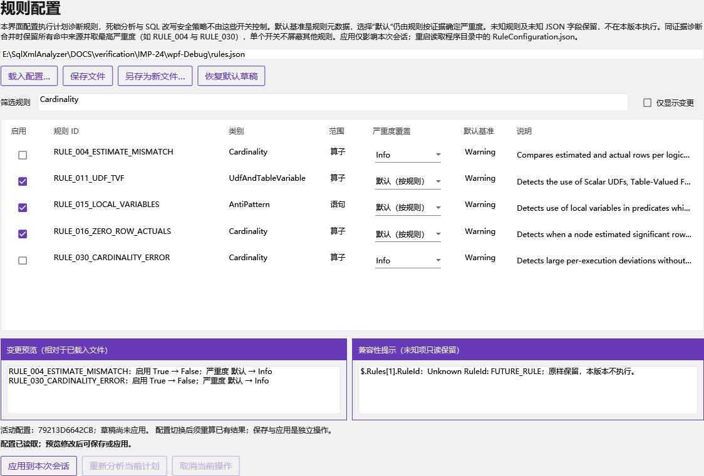
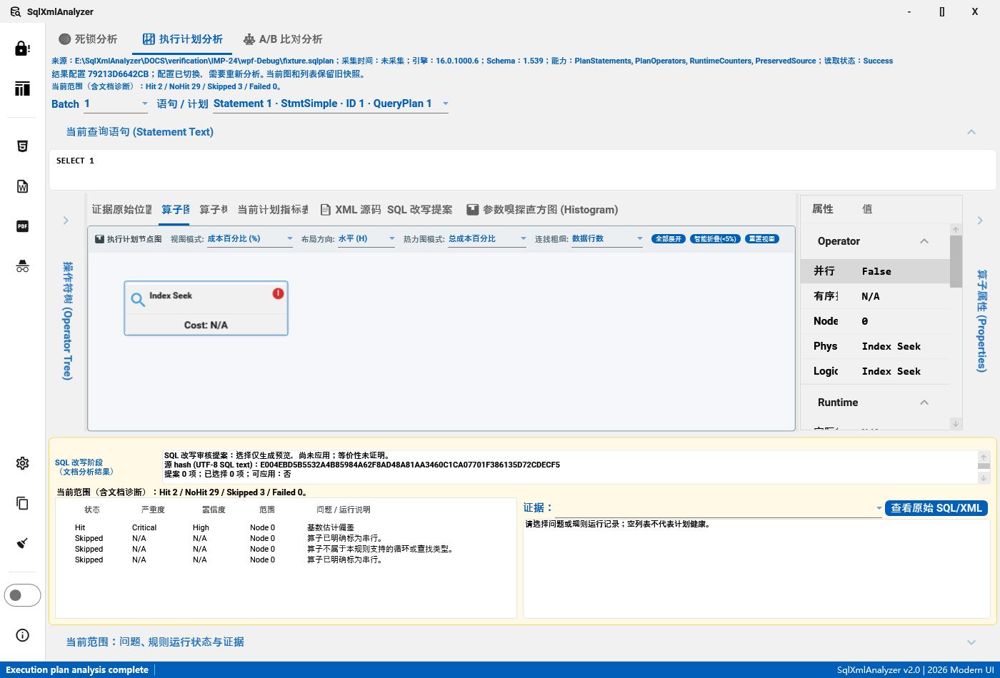

# IMP-24：兼容规则配置界面

2026-09-10 审查加固：来源随成功结果一起提交，重算及改写复用内存快照；配置切换仅取消执行计划；JSON 路径分配与错误长度受限，非法 Unicode 按校验错误处理。新增 22 项回归，两配置全量各 2549 通过。当前契约和证据见[加固说明](IMP-24审查修复与加固说明.md)，下文初版 2527 项验证保留为历史快照。

2026-09-10。对应 UI-12 / D05，基于 IMP-12 的诊断协议和 IMP-20 的工作区选择。本步实现规则配置、兼容读取与保存、会话应用及结果重算，不新增诊断规则 ID，不改变现有规则阈值和元数据默认严重度。

## 使用流程

1. 点击主窗口左侧齿轮“规则配置”。窗口读取程序目录中的 `RuleConfiguration.json`，列出 34 条已注册规则的 ID、类别、作用域、说明、启用状态、严重度覆盖及默认基准。说明可通过悬停完整查看。
2. 按 ID、类别、作用域或说明筛选；勾选“仅显示变更”检查相对于已载入文件的差异。勾选框和严重度下拉框立即更新草稿及变更预览。
3. “恢复默认草稿”将所有已知规则设为启用、严重度覆盖设为默认；保留未知规则与扩展字段。此操作本身不保存文件、不应用配置。
4. “保存文件”更新已载入文件；“另存为新文件”只创建新的 `.json` 文件，不覆盖既有文件。要更新其他文件，先载入它，再保存。
5. “应用到本次会话”影响后续执行计划分析。配置有效设置发生变化时只取消旧执行计划分析、清除旧 SQL 改写审核对象，并将已有工作区结果标为需要重新分析。图和列表保留同一份旧结果，直到点击“重新分析当前计划”或重新打开计划。重算使用上次成功分析的内存输入，读取磁盘新内容需重新打开文件。

载入、编辑、保存、应用相互独立。保存成功不自动应用，应用也不自动保存；“重新分析当前计划”只在草稿已应用且有当前计划时可用。关闭配置窗口会丢弃未保存的草稿，但不会撤销已经应用的会话配置；再次打开默认读取程序目录的文件。重启读取默认路径，载入/另存其他路径不会自动更改启动路径。

默认文件缺失时明确使用内置默认值。默认文件无效时允许启动并打开编辑器，但执行计划分析被阻止，直到明确应用有效配置。无效文件不能作为可写基准载入：可根据报错位置修复原 JSON 后重新载入，或恢复默认草稿并明确应用到会话、另存为新文件；不会以默认值静默覆盖损坏文件。失败载入保留此前有效草稿及活动配置。首次载入、保存及重算期间禁用冲突操作，取消/关闭不会让迟到的载入覆盖当前状态。

## JSON 兼容契约

原有配置无需升级，例如：

```json
{
  "Rules": [
    { "RuleId": "RULE_004_ESTIMATE_MISMATCH", "Enabled": false },
    { "RuleId": "RULE_015_LOCAL_VARIABLES", "Enabled": true, "SeverityOverride": "Warning" }
  ]
}
```

| 项目 | 行为 |
| --- | --- |
| `Rules` 缺省、`null` 或空数组 | 使用已知规则的内置默认值 |
| 已知规则的 `Enabled` 缺省 | `true`；显式值必须是 JSON 布尔值 |
| `SeverityOverride` 缺省、`null`、空白字符串 | 由规则按证据确定严重度；不是强制改成元数据基准 |
| 明确严重度覆盖 | `Info` / `Warning` / `Critical`，忽略大小写并规范化 |
| 属性名和已知 RuleId 大小写 | 兼容读取；写回保留已有属性名与规则 ID 的拼写 |
| 旧别名 | `RULE_016_WAIT_STATS` → `RULE_036_WAIT_STATS`；`RULE_017_RESOURCE_SEMAPHORE` → `RULE_037_RESOURCE_SEMAPHORE`，提示迁移但不强制改写原 ID |
| 未知 RuleId | **由拒绝加载改为只读保留并警告，本版本不执行**；其未来 `Enabled` / `SeverityOverride` 结构不按本版本解释 |
| 根对象、已知规则中的未知字段 | 保留 JSON 语义；编辑与恢复默认只修改已知规则的启用/覆盖值 |
| 重复项 | 拒绝重复 RuleId（含大小写及别名冲突）、重复已知属性（忽略大小写）、重复 JSON 属性名，避免含糊覆盖 |
| 无效输入定位 | 例如 `$.Rules[0].Enabled`；语法错误包含路径、从 1 开始的行号和字节位置；不返回部分有效配置 |
| 输入预算 | 文件字节和解码后 UTF-8 表示各最多 1 MiB；最多 1024 条规则项，JSON 深度最多 32，RuleId 最长 256 字符 |
| 编码 | 无 BOM 的严格 UTF-8，或带 BOM 的 UTF-8 / UTF-16 LE/BE / UTF-32 LE/BE；拒绝不可解码字节 |

写回可调整缩进、转义和已知字段的显式表示，不承诺原文件逐字节不变；原始字节保存在备份中。不会将未知规则投影成当前版本的 `RuleConfig` 后再覆盖原文。旧 API 的 `RuleConfigurationRoot` 是仅含已知项的执行投影，需要兼容保存的调用方应使用 `RuleConfigurationLoadResult.Document`。

## 严重度与结果一致性

界面使用 [RuleMetadataCatalog](../SqlXmlAnalyzer.Core/Rules/RuleMetadata.cs) 的现有 34 个 ID；**没有新增 ID 或修改默认级别**。

| 元数据基准 | 规则 |
| --- | --- |
| Info | `RULE_006_RESIDUAL_PREDICATE`、`RULE_014_SERIAL_PLAN_REASON` |
| Critical | `RULE_012_NESTED_LOOPS_HIGH_EXEC`、`RULE_018_OPTIMIZER_ABORT`、`RULE_023_RUNNING_TOTAL_PATTERN`、`RULE_037_RESOURCE_SEMAPHORE` |
| Warning | 其余 28 条已注册规则，完整 ID、类别和作用域见界面及元数据目录 |

“默认”意味着严重度随证据决定。例如估计偏差的元数据基准是 Warning，强偏差证据仍可生成 Critical。“恢复默认”移除已知覆盖含义，与重新载入发行文件中明确写入的覆盖值不是同一个操作。

同语义、同位置、同证据的诊断继续保留全部命中来源并取最高严重度。例如 RULE_004 与 RULE_030 都检查基数偏差；只把 RULE_004 改为 Info 时，RULE_030 的 Critical 仍会保留。要把该合并诊断设为 Info，需要同时调整相关来源；禁用一个规则也不屏蔽其他来源。失败运行记录仍为 Failed / Critical，覆盖值不能隐藏失败。

每次分析捕获不可变配置，诊断报告保留每条规则的有效设置。活动配置使用有效设置的 SHA-256 指纹比较，未知字段或 JSON 排版变动不会触发无意义重算；明确覆盖和默认值分别比较。生产图节点从本次报告提取算子/语句/计划诊断，不再另读配置或重复执行规则。工作区、选中报告及统一导出报告都携带配置状态。

原始 SQL Server 警告、运行计数展示提示、缺失索引采集事实仍是原始证据，不受诊断规则开关控制；节点提示已标注这一边界。配置窗口不控制死锁分析或独立 SQL 改写安全策略。

## 保存与异常

`RuleConfigurationStore` 复用写回服务：保留源编码/BOM和原字节快照，在写入前与临时文件落盘后两次核对源，生成并验证原文件备份，刷新临时文件后同目录替换；不会原地截断文件。源被外部修改、权限不足或替换前失败时原文件保留。源文件的重解析点/EFS 限制沿用写回服务。新文件使用独占临时文件和不覆盖的同目录移动。

替换已发生但确认失败时明确显示“写入已发生”或“提交结果未知”，要求重新载入核对；不会错误声称源文件未变化，也不会用旧备份自动覆盖新的外部内容。提交后的迟到取消不会被当作尚未写入；保存不隐式改变活动配置。备份路径显示在保存结果中。

可预期的校验、编码、I/O、权限和取消错误通过统一异常策略呈现；未知错误生成真实 Windows minidump 和 `exception.json`，同一异常实例仅捕获一次。默认目录是 `%LOCALAPPDATA%\SqlXmlAnalyzer\dumps`，失败时尝试 `%TEMP%\SqlXmlAnalyzer\dumps`。窗口显示 DUMP 路径或捕获失败原因，诊断组件本身失败也保留主错误与提交状态。取消后的旧分析若发生未知错误仍记录诊断，但不覆盖新工作区。

| 构建模式 | 日志 |
| --- | --- |
| Debug | 调试、警告、错误、致命 |
| Release | 仅错误、致命；运行参数不能打开被构建门禁排除的级别 |

配置正常日志只记录阶段、数量和应用是否变化，不记录整份 JSON、未知扩展负载或 SQL。错误使用现有日志策略；DUMP/异常附件沿用诊断文件访问控制。

## 验证

新增 47 项回归，并更新旧的未知规则拒绝测试。Debug/Release 全量各 **2527 通过、0 失败、0 跳过**；两配置解决方案构建均为 **0 警告、0 错误**。54 项配置定向测试覆盖兼容性、别名、严格解码、预算、不可变快照、实际规则级别/开关、既有语义合并、文件并发修改、替换确认丢失、取消、DUMP 成功与失败、诊断组件失效和分模式日志。

WPF 离屏测试宿主运行实际主窗口、入口按钮、配置窗口、复选框/下拉框绑定、保存及重算事件，核对图与列表共享同一上下文、保存冲突保留源文件、恢复默认产生预期诊断。绑定错误为零。此证据不等同于真实桌面鼠标/键盘、DPI 与屏幕阅读器验收；IMP-25 的布局/主题/键盘组合验收仍独立保留。

验证脚本、截图、日志与源文件指纹见 [验证入口](verification/IMP-24/README.md)及[机器可读摘要](verification/IMP-24/summary.json)。




