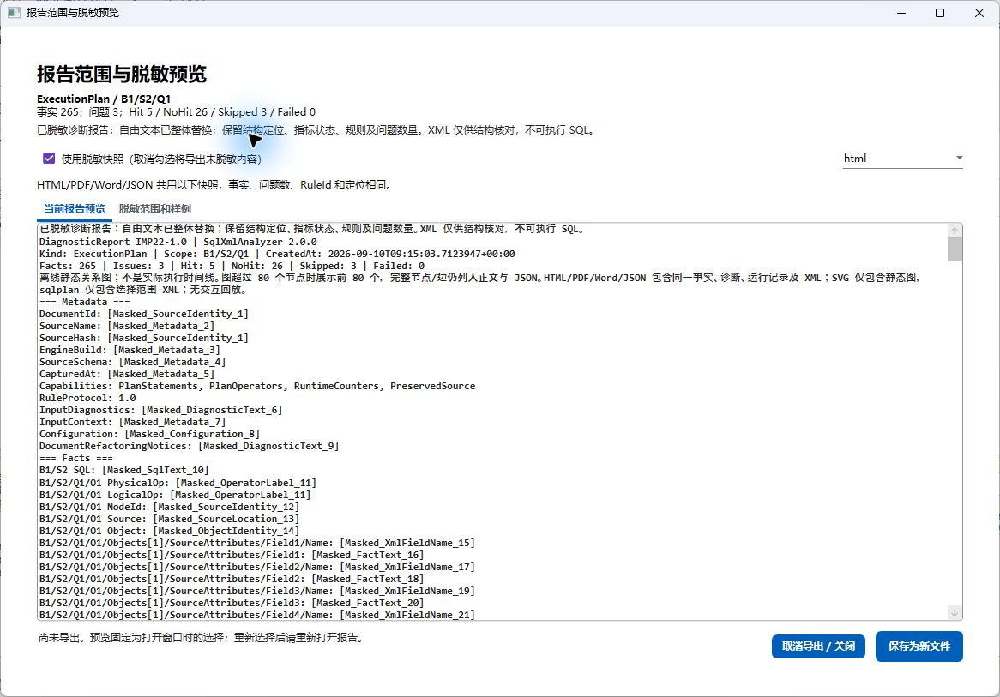

# IMP-29：完整构建、测试与用户场景验收

**2026-09-11 范围说明：** 本文保留 IMP-29 原阶段结果，不代表后续执行计划 UI 的任务型可用性通过。后续工作区的 [设计与差距评估](plan-workspace-design-and-gap-assessment.md)、[历史自动化证据](verification/plan-workspace-redesign/README.md) 和 [PW-01～PW-06 验收矩阵](verification/plan-workspace-redesign/acceptance-matrix.md) 独立记录状态；其中 0.1666% 极小视口属于已知可读性失败，真实 DPI、键盘与专家任务仍待验。发布前的新构建和测试以该目录实际生成的 `publish-validation.json` 为准。

**审查修复更新：** 验收版本绑定、构建警告误判及双配置证据被 Git 忽略的问题已修复；新增 25 项脚本回归。当前执行结果见[修复说明](IMP-29审查修复与加固说明.md)及[最新摘要](verification/IMP-29/summary.json)。下文保留原实施的 2766 项测试、可见桌面与性能观测，不能将历史数值误读为修复后新一轮结果。

2026-09-10（Asia/Taipei）。本步已完成验收工具、单元测试、构建/场景执行、发现问题修复及证据整理。自动化验收通过；整体验收为**有保留项通过**，不授予发布许可。47 项 R / D / UI 的状态见[逐项矩阵](verification/IMP-29/acceptance-matrix.md)：38 项在声明范围内关闭、5 项缓解、4 项部分验收。IMP-30 及 M7 全面关闭仍待后续证据。

## 本轮发现并修复的问题

可见 Release 窗口打开多语句计划，选择第二语句并打开报告时，长报告撑大了预览区域，“保存为新文件”按钮落到窗口外。根因是通用可访问性包装器用 ScrollViewer 测量原 Grid；无限可用尺寸下，星号行没有得到有限预览高度。Microsoft 文档说明，无限可用尺寸表示元素可按内容大小布局，参见 [FrameworkElement.MeasureOverride](https://learn.microsoft.com/en-us/dotnet/api/system.windows.frameworkelement.measureoverride?view=windowsdesktop-8.0)。网页搜索接口不可用，本轮通过 HTTPS 读取 Microsoft 官方页面核对该行为。

`ReportReviewWindow` 改为显式外层滚动容器及 1080 × 700 DIP 内容区，报告正文在内部滚动；普通窗口能直接看到格式选择和保存按钮，紧凑窗口仍可滚动到完整控件。没有截断预览、改变报告数据或覆盖原文件。布局回归的普通/紧凑两例在修复前均失败（测试宿主预览高度 13660.55 DIP），修复后通过；真实原生保存对话框也已完成第二语句的脱敏 HTML 导出。

[实际保存完成截图](verification/IMP-29/desktop/report-saved.png)与[导出的脱敏 HTML](verification/IMP-29/desktop/statement-2-redacted.html)均为本轮生成。范围仍是 B1/S2/Q1，原始 `SELECT V FROM U` 文本不出现在脱敏输出中。

## 新增测试与异常、日志

共新增 12 项：6 项用户任务链、4 项探针失败边界、2 项报告布局回归。任务链覆盖两个具有重复 NodeId 的语句，各自选择证据、捕获会话、保存/恢复、双语句比较、报告和 ZIP 校验；两个死锁事件的独立分析/范围导出；取消或已有目标后的重试与审核字节保留。

独立探针共同编译 `AcceptanceProbeBoundary`，复用 `ExceptionPolicy`、`UnexpectedErrorReporter` 和 `WindowsMiniDumpWriter`。未知异常生成真实 Windows minidump 和异常 sidecar；即使被内部探针捕获并返回，外层也不记录为通过。预期输入、IO、权限和取消错误按现有分类处理。原产品的 DUMP 失败回退、去重及原始错误保留测试在全量回归中执行。DUMP 和原始日志保留在本机 `.tmp.imp29-runs`，不会自动加入脱敏包或提交到文档。

日志门禁沿用生产实现：Debug 记录 Debug / Warning / Error / Critical；Release 仅 Error / Critical，不因强制 verbose 参数放宽。新增边界测试及既有诊断测试在两种构建模式下通过。这里的 Critical 对应用户要求的致命信息。

## 当前版本验证结果

| 验证 | Debug | Release | 具体证据 |
| --- | --- | --- | --- |
| 完整 restore / solution build | 0 警告 / 0 错误 | 0 警告 / 0 错误 | 构建日志和程序集 SHA-256 |
| 完整 xUnit | 2766 通过，0 失败，0 跳过 | 2766 通过，0 失败，0 跳过 | 完整 TRX；相对 2754 基线新增 12 |
| SQL 语义 / 观察器 / 类型 | 100 项检查通过 | 100 项检查通过 | 每种构建均运行 SQL Server 2019 与 2025 |
| 审核应用与报告失败 | 通过 | 通过 | 真数据库验证、精确写回、BOM、原始备份、提交后报告失败仍保留真实提交状态 |
| 索引 DDL 目标与回滚 | 两引擎共 10 目标通过 | 两引擎共 10 目标通过 | 点号、转义、中文/空格、跨库/架构对象与错误服务器阻断 |
| CLI / 配置 / 会话兼容 | 22 检查通过 | 22 检查通过 | 独立 CLI 进程和真实文件转换；13 个冻结样例 hash 不变 |
| CLI 无效输入 | 3 检查通过 | 3 检查通过 | 损坏 XML、无关根和 DTD 均非成功且退出 1 |
| WPF 实际窗口测试宿主 | 8 组通过 | 8 组通过 | 选择/证据、A/B/改写/索引、报告、XEL、配置、可访问性、大图/取消、诊断包；零绑定错误 |
| 真实 XEL 检索与追溯 | 通过 | 通过 | 本轮采集 2 事件、1 分组、4 个非死锁记录；筛选保持原事件，损坏输入 Invalid |
| 可见桌面与原生保存 | — | 通过已执行子集 | 当前桌面鼠标/按键注入、原生对话框、实际 HTML 文件；不等于全部实机矩阵 |

SQL 引擎实际版本：2019 `15.0.4382.1`、2025 `17.0.4075.5`；语义套件分别使用兼容级别 150/170。Windows 构建环境 `.NET SDK 10.0.400`，应用目标仍为 .NET 8。专用测试数据库/XE 会话/索引测试实例已清理；保留原有 LocalDB 实例。未生成覆盖率报告，不声称覆盖率增加。

当前摘要、逐项结果和校验入口见 [verification/IMP-29/README.md](verification/IMP-29/README.md)。原日志、完整 TRX、SQL 请求/结果、故障 sidecar 和 DUMP 保留本地；文档复制必要摘要、合成样本截图和脱敏报告。

## 场景执行与证据边界

多语句任务由新增场景测试、W20/W21/W22/W27 和可见桌面共同覆盖：打开计划 → 切换第二语句 → 定位问题与 SQL/XML → A/B 中显示已匹配/未匹配及不可比原因 → 审核改写候选 → 保存会话、导出报告/诊断包。数据库侧另通过真实审核凭据验证与精确应用；候选成功不等于已应用，也不证明一般 SQL 等价。

多事件任务由 W20/W23 与本轮真实 XEL 覆盖：导入 → 选择/分组/时间、对象、SQL 筛选 → 原事件定位 → 图和依赖推演 → 导出所选事件。记录原始字节位置，区分事件序号与载荷序号；两个有效事件外的记录没有被当作错误死锁。

复用的 IMP-24 历史 WPF 探针有两处入口过时：IMP-25 将工具栏 Click 改为命令，IMP-26 将第二次分析改为复用现有诊断。当前适配器改走真实 RoutedCommand，并在 `IRefactoringEngine` 审核准备边界注入暂停，核对不可变捕获 envelope、取消旧请求与源文件变化后的重算。未删除原有业务断言。首次失败及超时记录保留；只有最终零警告、通过的双配置复验进入验收。故障同时验证了探针真实 DUMP 路径。

## 性能与未完成项

性能输入使用与 IMP-26 相同 SHA-256 的 100 / 1000 / 5000 算子合成计划，另用本轮真实多事件 XEL。每个输入独立进程测一次冷打开、同进程测一次热打开，记录 20 ms 采样的 UI 调度 P95/最大延迟、总时间、64 节点首屏、峰值工作集及阶段状态。首轮与其他测试并行的数据单独保留；正式列入摘要的是其他探针结束后的顺序重测。详见[性能记录](verification/IMP-29/summary.json)。

这不是统计基准或性能 SLA。P95 100 ms 为规划候选目标，尚未全面通过；500 ms 取消确认候选在 W26 的已测路径通过。实际 OS DPI、多屏移动、屏幕阅读器、实体键盘完整路径及外部 PDF/Word/浏览器/SSMS 呈现矩阵未完成，仍列为部分验收。没有替用户更改系统显示/辅助技术设置，也没有将位图缩放或注入按键宣称为物理设备验收。

本机顺序重测结果（冷/热分别为各一次观测；峰值工作集为该进程累计峰值）：

| 输入 | 冷/热总时间 ms | 冷/热调度 P95 ms | 冷/热峰值 MiB | 终态 |
| --- | --- | --- | --- | --- |
| 100 算子 | 1786.3 / 1642.1 | 215.4 / 189.0 | 219.6 / 240.7 | Ready |
| 1000 算子 | 2220.5 / 2436.7 | 275.5 / 146.2 | 258.0 / 319.9 | Ready |
| 5000 算子 | 2402.4 / 2691.9 | 163.1 / 66.5 | 405.8 / 597.5 | Ready |
| 两死锁事件 XEL | 303.5 / 81.4 | 59.0 / 54.2 | 183.9 / 186.3 | Partial（另有非死锁记录） |

与历史 IMP-26 的同输入记录相比，100/1000 算子测量明显更慢，5000 算子总时间没有同样变化；当前工作站还有用户应用/虚拟机负载，不能由单次前后结果判定代码性能回归或改善。此次产品修复仅涉及报告窗口布局，未修改计划分析算法；性能目标继续保留未通过状态，不能据此宣布达标。

## 复跑与后续

从仓库根执行 `./DOCS/verification/IMP-29/Run-Acceptance.ps1`；默认创建带时间和随机后缀的新目录，任何已有输出目录都会被拒绝。各阶段可单独运行，完整入口顺序执行以减少自身负载对性能的影响。运行依赖已安装的 .NET SDK、SQLLocalDB 2019/2025、sqlcmd、Windows WPF，以及专用 `SqlXmlAnalyzer_IMP19_2019` / `SqlXmlAnalyzer_IMP19_2025` 语义测试实例。不要指向生产 SQL Server。

本轮交付的 `accepted-runs.json` 明确选择各阶段最终证据；`Write-Validation.ps1` 检查通过状态、计数、冻结样例、实际字节和程序集，然后生成摘要。`-VerifySources` 只校验现有 source/artifact hash，不覆盖证据。未来复跑应审核新记录并更新对应映射，不自动继承本轮的“关闭”结论。

IMP-30 继续负责发布版本、升级迁移及回滚演练；当前未提交、打包或发布。后续必须补齐矩阵中的未验收条件，才能讨论全面关闭 M7。
