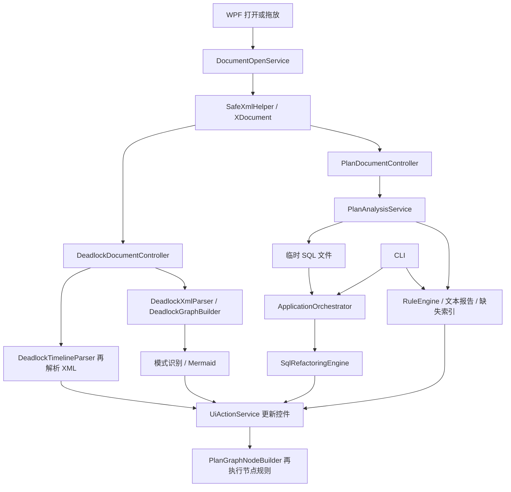

# 软件详细设计与问题分析

## 2026-09-11 当前设计与后续边界

执行计划工作区的当前设计、竞品依据及后续范围统一见[执行计划工作区设计与差距评估](plan-workspace-design-and-gap-assessment.md)。本次更新设计文档，不实施 PW-01–PW-06；提交前构建与测试见[本轮验证记录](verification/plan-workspace-redesign/publish-validation.json)，没有新增数据库或实机验收。以下原审查章节及历史行号继续保留，不将旧失败覆盖为当前通过。

已实现计划图为主的工作区、问题与检查状态分离、完整身份联动、按需证据区，以及 260×88 DIP 节点、主题提示框、缩放意图与异步布局协调、统一连接锚点和迭代式紧凑树布局。连续两次适应结果一致、节点进入视口等历史验证见[计划图优化记录](verification/plan-workspace-redesign/graph-polish.md)。这些几何结果不证明极低比例下的文字可读。

当前仍以离线计划诊断为主：实际指标来自输入文件，A/B 是捕获快照比较，索引沙箱不建索引且不预测收益；LocalDB 仅提供受限场景语义验证，不是在线性能采集。参数统计支持手工导入，默认教学示意不是真实直方图。34 条默认规则、报告、CLI 和审核流程已存在，但不据此声称准确率或性能优于竞品。

| 后续阶段 | 统一待办 | 状态 |
| --- | --- | --- |
| 首屏可读与归属正确 | PW-01 画布可读性；PW-02 诊断范围徽标；PW-03 问题摘要 | 待实施 |
| 证据与操作清晰 | PW-04 详情与统计证据表达；PW-05 命令和工作流 | 待实施 |
| 采集与实验闭环 | PW-06 在线采集与实验历史 | 后续功能，尚未实施 |

竞品对照限定为免费专有的 SolarWinds Plan Explorer 及商业 dbForge profiler，不把 SQL Sentry 监控平台能力混入。官方来源、五项未修 UX 问题、代码／截图依据和完成标准均集中在[主文档](plan-workspace-design-and-gap-assessment.md)，后续实现更新该处状态。

## 历史审查与实施注记

**实施进展（2026-09-08）：** D08 的字段分类、未知字段阻断和共享输出限制已实施。 当前实现、验证及限制见[IMP-05 脱敏覆盖与输出入口验证](./IMP-05脱敏覆盖与输出入口验证.md)。下文保留原审查时点的发现与行号，不将历史失败改写成通过。

日期：2026-09-08。基线及审查边界见 [文档入口](./README.md)；具体代码缺陷见 [代码 Review 报告](./代码Review报告.md)。本文将“当前实现”“已确认问题”“建议设计”分别说明，建议接口不表示已经实现。

## 1. 项目定位与当前能力

项目是本地离线 SQL Server 诊断桌面程序，主体为 .NET 8 WPF/C#，另有 CLI。输入包括执行计划 XML、死锁 XML/XDL、XEL 事件文件以及用于改写的 SQL。现有能力覆盖算子图、规则报告、缺失索引、SQL AST 改写、死锁等待图与步骤展示、执行计划快照比较、调优会话保存及 HTML/PDF/Word 导出。

其产品价值在于把原始 XML 变成可定位、可解释的调查依据。应把离线文件能够证明的事实与需要运行环境才能证明的原因分开。例如：溢写记录是事实，内存不足的具体原因需要上下文；缺失索引 Impact 是编译估算，不能视作实测加速比例；死锁图描述捕获时的依赖，不能还原每次加锁的真实时间顺序。依据：[执行计划](https://learn.microsoft.com/en-us/sql/relational-databases/performance/execution-plans)、[缺失索引限制](https://learn.microsoft.com/en-us/sql/relational-databases/indexes/tune-nonclustered-missing-index-suggestions)、[死锁指南](https://learn.microsoft.com/en-us/sql/relational-databases/sql-server-deadlocks-guide)。

## 2. 当前模块职责与依赖

| 模块 | 当前职责和关键入口 | 设计判断 |
| --- | --- | --- |
| WPF 主项目 | `App.ConfigureServices` 组装依赖；`MainWindow.*` 接线；`Views/*` 承载视图 | 已进行明显的壳层拆分，可继续复用 |
| `Services/*UiActionService` | 控件更新、事件转发、图构建和导出交互 | 测试粒度较细，但领域分析与渲染仍有重复 |
| WPF 项目内 `Core/Services` | 文档控制、图属性/布局、快照比较、脱敏、索引部署脚本 | 名称像领域层，实际混合应用服务及 WPF 依赖 |
| `SqlXmlAnalyzer.Core` | SafeXmlHelper、规则、死锁模型、XEL、统计、评分、旧改写引擎 | 核心功能集中；XML 查询和诊断表现文本耦合 |
| `src/SqlXmlAnalyzer.Analysis` | `SqlXmlAnalysisEngine` 把规则结果转成 `AnalysisReport` | 转换会丢失结构化定位信息；输入类型验证不足 |
| `src/SqlXmlAnalyzer.Refactoring` | ScriptDom 解析、规则迭代、语法再解析 | 有 AST 基础及若干保护条件，但语义证明不足 |
| `src/SqlXmlAnalyzer.Application` | `ApplicationOrchestrator` 读取文件、分析、改写、备份/写回、报告 | 同时承担计算和不可撤回的文件发布，应细分边界 |
| CLI | 扫描门禁、JSON/控制台输出、SQL 改写 | 扫描逻辑与 WPF 的文档分类入口不一致 |
| Tests | xUnit / FluentAssertions，引用核心、应用、CLI 和 WPF | 当前可运行；领域反例与实际数据库测试仍需补齐 |

### 2.1 当前数据流

图中的重复分析有代码依据：`PlanAnalysisService.Analyze:44–65` 生成诊断及改写输入；`RefactorSql:92–101` 经文件调用编排器，后者重新读取计划；`PlanGraphNodeBuilderService:116–132` 为图节点再次调用规则。死锁分析也在 `DeadlockAnalysisService:45–46` 将 XML 转字符串交给另一条解析路径。

### 2.2 已有值得保留的设计

- `SafeXmlHelper` 禁止 DTD 并关闭外部解析，静态检索未发现业务入口绕过它直接加载 XML。
- `AnalysisSessionCoordinator` 以请求编号和 CancellationToken 避免过期结果覆盖；文档 UI 服务在异步返回后检查 IsCurrent。
- `RuleMetadata` 已定义类别、作用域和稳定 ID；配置加载有错误结果与兼容处理。
- SQL 改写使用 ScriptDom，输出重新解析；部分标量子查询规则已有 TOP/GROUP BY 等保护条件。不能笼统认定所有改写都是字符串替换。
- HTML 报告已经使用 HTML 编码、CSP 和 Mermaid 安全设置。本次不重复宣称存在已解决的直接 HTML 注入。
- 视图、图布局及交互已被拆成服务，适合逐步替换内部模型，无需推倒重做。

## 3. 已确认的核心设计问题

| 编号 | 设计问题 | 代码证据 / Review 对应 | 影响 |
| --- | --- | --- | --- |
| D01 | 入口没有共享的输入类型契约 | `DocumentOpenService.ClassifyXml`、`SqlXmlAnalysisEngine.Analyze`；R04/R05 | GUI 拒绝可解析的包装死锁，CLI 接受无关 XML |
| D02 | 文档、语句和算子身份未形成完整模型 | `AnalysisResult` 只有 NodeId；`PlanAnalysisService` 只取首语句；R14/R16 | 多语句、多 schema 的结果归属含糊 |
| D03 | 原始 XML 的作用域由各调用者自行决定 | `Descendants` 分散于规则与 UI；R09/R10/R11/R17 | 重复计算、指标口径分裂、子节点事实归到父节点 |
| D04 | 图与回放维护两套死锁算法 | `DeadlockGraphBuilder`、`DeadlockTimelineParser`；R08/R18/R22 | 环节点不一致，重复环，合成步骤被描述成真实历史 |
| D05 | 诊断事实、推测根因和修复方案混成文本 | `DeadlockPattern`、规则 Message / `|||`；R07 | 无法分别筛选置信度、证据和建议适用条件 |
| D06 | 改写成功仅意味着生成 SQL 可解析 | `SqlRefactoringEngine:117–133`；R02/R19/R20 | 合法输出仍可能改变结果、事务语义或对象名称 |
| D07 | 文件写回不具备可靠失败边界 | `ApplicationOrchestrator:84–93`；R03 | 备份失败后仍覆盖原文件 |
| D08 | “脱敏”依赖少量属性黑名单 | `PlanObfuscatorService`；R01 | 共享输出仍含常量、服务器名和别名 |
| D09 | 估算值、实测值和模型假设未充分区分 | `CostImpactSimulator`、比较器；R12/R15/R21 | 用户可能把模拟收益或缺失指标当成实测改善 |

## 4. 建议的详细设计

### 4.1 文档入口与解析契约

**IMP-09 实施更新（2026-09-08）：** 下述读取接口、来源/能力、预算、Partial 和取消契约已落地，GUI/CLI/Analysis 已接入；具体 API 命名、默认值测量、兼容性及验证边界以 [IMP-09 实施说明](IMP-09统一文档读取与能力契约.md) 为准。以下设计分析保留原始建议；层级身份已由 IMP-10 实施，会话持久化继续由 IMP-20 实施。

建议统一为 `IDiagnosticDocumentReader.ReadAsync(Stream, DocumentReadOptions, CancellationToken)`。路径仅用于展示和打开流；扩展名用于候选类型提示，最终分类依据根元素、命名空间和支持的包装结构。

结果模型建议包含：

| 对象 | 字段 | 约束 |
| --- | --- | --- |
| DocumentEnvelope | DocumentId、SourceHash、SourceName、DetectedKind、CapturedAt、EngineBuild、SchemaVersion | 无法从输入获知的字段为 null，不补造版本/时间 |
| ParseOutcome | Status、Value、Diagnostics、Capabilities | 状态区分成功、部分成功、格式错误、不支持、超限、已取消 |
| SourceLocation | XML 路径、行/列、BatchKey、StatementKey、NodeKey | 节点位置必须指向同一份输入快照 |
| DocumentReadOptions | 文件字节、XML 字符、深度、节点数、XEL 事件数预算 | 默认值先用样例基准确定，允许用户显式调整 |

支持裸 `<deadlock>`、`<deadlock-list>`、XE 包装中的 deadlock，并将多事件返回为集合而非默默只取第一条。ShowPlan 用 `Root.Name.Namespace` 识别命名空间，避免有前缀但没有默认命名空间时遗漏节点。未知命名空间应产生 UnsupportedFormat，而不是零问题的成功结果。

DTD 禁止和 `XmlResolver=null` 应保留。补充大小/深度预算、读取过程取消、过深图的迭代遍历。当前缺少这些限制是资源使用风险，尚未通过大文件基准证明具体崩溃阈值。

### 4.2 执行计划领域模型

**IMP-10 实施更新（2026-09-08）：** 层级、源序号键、独立对象名称段及别名已经落地，报告/图/CLI/比较适配器携带身份。缺失或重复 NodeId 另用 OperatorOrdinal 消歧；源 XML 修改使旧定位失效。旧规则在副本执行，图形选择使用完整键，多计划比较要求显式选定 QueryPlan。Debug/Release 构建均 0 警告/错误，各 1290 测试通过，8 个既有输入的旧规则字段保持一致。详见 [IMP-10 实施与边界](IMP-10语句算子与对象身份.md)。下述指标/谓词全集、全量规则迁移、跨计划语义比较及 UI/持久化仍分别属于 IMP-11/12/17/20/21。

建议一次解析为不可变 `PlanDocument → Batch → Statement → QueryPlan → OperatorNode`。算子标识至少为 `(DocumentId, BatchOrdinal, StatementOrdinal, QueryPlanOrdinal, NodeId)`；不要把 NodeId 当全文唯一键。StatementId/QueryHash 可作为元数据，缺失或重复时仍有稳定的文档内序号。

对象名称用 `SqlObjectIdentity(Server?, Database?, Schema?, Object)` 表达，保留每个标识符分段及原始大小写；数据库排序规则未知时，不直接以全局 OrdinalIgnoreCase 合并不同对象。别名和物理对象名分别存储。

每个算子保存：自身估算、运行线程计数、谓词、输出列、对象、排序/分区/执行模式、原始 XML 定位。解析算子自身属性时，遍历到下一个 RelOp 就停止；子树聚合必须调用名称明确的聚合接口。

### 4.3 统一指标定义

| 指标 | 建议定义 | UI 表达 |
| --- | --- | --- |
| EstimateRows | 优化器预估行数及其作用域 | “估算输出行数”，附 XML 字段 |
| ActualRowsTotal | 有效线程 ActualRows 累计 | “实际输出行数”；不存在时 N/A |
| ActualRowsReadTotal | 对应运行计数累计，独立于输出行数 | “实际读取行数”；不拿输出行数填空 |
| ExecutionCount | 同时保留每线程值和派生口径 | 明示总次数/单线程次数，不混用 |
| EstimateError | 在已识别串行、并行、重执行形态后进行同口径比较 | 无法可靠归一化时显示“需确认计数口径” |
| Elapsed | 来源节点及线程聚合方式随值保存 | ms；无数据不能当成 0 ms |
| EstimatedCost | 优化器成本及自身/子树区别 | 不标注为实际耗时 |
| HeuristicRecost | 本工具基于行数等构造的启发式权重 | “估算权重（模型）”，不冒充 SQL Server 重优化 |

R09 的 16 个 worker 各执行一次，是应直接修复的反例；不能据此把所有算子的次数一律改用 Max。嵌套循环重复执行、分区访问、并行分支和协调线程应分别建立真实计划夹具。

### 4.4 规则协议与证据模型

建议引入 `AnalysisContext`：含已解析模型、语句索引、算子索引、运行能力、引擎版本、配置快照和取消令牌。规则返回 `IReadOnlyList<DiagnosticFinding>`，避免 Plan 规则只能返回一个结果而跨语句漏报。

Finding 建议字段：FindingId、RuleId、RuleVersion、Severity、Confidence、Scope、Location、Evidence[]、Hypotheses[]、Recommendations[]、Limitations[]。其中：

- Evidence 是 XML 或计算直接支持的事实，例如请求/持有锁模式、估算与实际计数。
- Hypotheses 是待验证原因，例如数据倾斜、参数敏感、统计信息质量，不用“必然”“已严重过时”覆盖不确定性。
- Recommendation 带适用前提、潜在代价、验证方法及来源，不把 RCSI、MAXDOP、RECOMPILE、填充因子当成统一处方。
- 规则运行状态区分 Hit、NoHit、Skipped、Failed；个别规则异常不等价于健康，也不一律标为 PARSE_ERROR。

规则去重以语句、算子、问题类别和证据指纹为键；保留参与规则 ID。34 个注册规则不等于 34 个独立问题类型，报告中的固定“17 项完美通过”应改成此次实际运行、跳过和失败的数量。

### 4.5 死锁模型与分析

保留 ProcessId、SPID、ECID、事务信息、priority、logused、executionStack、inputbuf；受害者改为集合。资源保留原 XML ID、资源类型及类型特有属性，不只生成 `res_n` 而丢弃业务定位字段。

锁资源与 Exchange/SyncPoint 等资源采用可扩展模型。Microsoft 的 KB4089473 说明了 exchangeEvent、SyncPoint 和 ExchangeSpillDetails 的诊断字段；这些字段应保留用于解释，不能仅因 ECID 非零就下结论为查询内部并行死锁。[KB4089473](https://support.microsoft.com/en-us/topic/kb4089473-better-intra-query-parallelism-deadlocks-troubleshooting-in-sql-server-2017-and-2016-c0cc8ac0-ae4f-966a-b6ed-29dfcd17972a)

图算法建议分两层：

1. 用强连通分量识别循环依赖成员，供主图、列表和“聚焦关键环”共享；普通锁转换对自身持有者的关系与真正自等待资源应按类型处理。
2. 在分量内按需生成有限条解释路径。环规范化先去掉闭合重复节点，再按旋转等价去重；涉及不同资源边时保留区别，设置数量上限和截断标记。

图解析一次后生成“依赖形成示意步骤”。只有另有带可靠时间和关联键的事件序列时，才提供真实时间线。XEL 时间使用 DateTimeOffset 保留时区和精度；事件列表显示捕获时间，示意步骤不伪造毫秒时间。

### 4.6 SQL 改写与写回设计

把当前过程拆成 `Analyze → Propose → Validate → Review → Apply`。离线解析成功只能作为语法校验。建议每项 RewriteProposal 包含原范围、替换范围、规则、前提、语义风险、验证状态和用户选择。

| 改写类型 | 默认行为 | 提升为可应用的证据 |
| --- | --- | --- |
| 已证明的局部等价变换 | 可预选并显示 diff | 对应类型/NULL/边界反例通过 |
| 删除 LTRIM/TRIM | 默认保留原 SQL，仅提示候选 | 明确约束证明无前导空格等条件 |
| 表变量转临时表 | 默认建议，不自动纳入普通改写 | 事务、作用域、重入、命名碰撞、UDF/过程上下文验证 |
| JOIN/子查询变换 | 逐规则声明安全域 | 重复行、NULL、空集合、聚合、TOP/ORDER BY 等等价性 |
| 基于计划的类型/索引建议 | 缺少 schema 时标记依赖证据 | 真实类型、排序规则及目标对象身份 |

ScriptDom 官方定位为解析和格式化库；重新解析不提供数据库对象绑定和执行等价证明。[SqlScriptDOM](https://github.com/microsoft/SqlScriptDOM/tree/b583737682dbb1682b97d0ac5a5261dc94279b8d)

写回流程建议：记录输入 hash → 同目录临时写入并刷新 → 必需备份成功 → 核对原文件未被外部修改 → 在文件系统支持的条件下替换。任一步骤失败均返回清晰错误并保留原文件；备份不使用无限覆盖的单一 `.bak`。CLI 的 dry-run、输出新文件和覆盖源文件语义要分别测试。

### 4.7 索引建议与沙盒

2026-09-09 实施更新：IMP-15 已完成完整目标和 DDL 引用；[IMP-16](./IMP-16模拟顺序依赖与模型限制.md)已修复先后顺序与自身/子树成本重复累计，明确候选组合按算子并集处理。SQL Server Impact、工具评分与输入假设分别公开来源，缺少覆盖证据保持未知且不给分；模型版本、权重、范围和限制可见。[审查加固](./IMP-16审查修复与加固说明.md)进一步修复括号/数值、CASE 与结构化 NULL 取证，约束参数归属与后备条件，评分模型升为 2.0.1。当前只描述原计划成本，不恢复未校准的收益预测。以下保留设计动机，未据此宣称整个工作负载验收完成。

建议模型补充 Database、StatementKey、来源、列顺序与列角色。生成 DDL 必须分开处理“单个标识符转义”和“多段对象名组装”。名称中合法的点号不能被拆成分隔符；生成名称要有稳定后缀以避免仅截取前三列导致碰撞。

评分与沙盒应公开权重和假设，区分 SQL Server 原始 Impact、本工具评分及未经执行验证的假设。先修复 R12 顺序依赖，再检查自身成本与子树成本重复累计。缺少筛选谓词、覆盖列、排序键证据时，不断言可 Seek、可消除 Lookup 或 Sort。建议暂时取消对用户承诺的精确“收益百分比”。

生成部署包时应显示目标数据库/schema、版本适用性、DDL、回滚范围、验证条件；索引是否存在以及是否与现有索引重复，是需要额外 schema 数据才能判断的事项。单份执行计划无法证明整个工作负载都受益。[缺失索引限制](https://learn.microsoft.com/en-us/sql/relational-databases/indexes/tune-nonclustered-missing-index-suggestions)

### 4.8 快照与比较

2026-09-09 联合审查加固：[比较证据完整性](./IMP-17比较证据完整性加固.md)补齐 BuildResidual、Sort/TopSort 和对象身份缺失门槛。结构不足沿子树传播，未知对象禁止估算与运行差值，人工选择不绕过检查。模型 1.2.0，新增 55 项回归，Debug/Release 各 2012 项通过。以下为先前版本的设计和验证记录。

2026-09-09 审查加固：[IMP-17 修复说明](./IMP-17审查修复与加固说明.md)补齐 Seek 的范围列、运算符及有序表达式证据；比较范围独立于快照存储，允许共享快照的不同语句配对。会话 2.1 校验当前 XML 指纹后恢复原始来源关联，无法核验的旧记录不作为当前来源。新增 29 项回归，全量 Debug/Release 各 1957 项通过；以下保留初版设计和实施记录。

2026-09-09 实施更新：[IMP-17](./IMP-17多语句与可比性检查的AB比较.md)已实现全语句、唯一证据匹配和人工范围选择，版本/参数/指标口径控制可空差值，未匹配项持续可见。顶部不再由总成本直接宣称改善，会话保存来源和人工选择。Debug/Release 全量各 1928 项通过；以下设计原则继续适用，未据此宣称 SQL 等价或性能校准完成。

先匹配语句，再比较算子。语句候选可用 SQL/QueryHash、文档内位置和人工确认；算子候选应结合类型、对象、谓词和结构，不仅是相同子节点序号。显示匹配可信度，并将无法匹配的节点明确列为新增/删除/待匹配。

比较每个运行指标前验证双方是否存在，以及数据单位与采集条件是否可比较。估算计划与实际计划可以比较结构和估算成本，但不能生成缺失运行数据的“改善值”。快照保存时保留输入哈希、版本、兼容级别、参数可见性和指标来源。

### 4.9 报告、脱敏与本地数据

建议让 HTML、PDF、Word、剪贴板和 CLI JSON 都消费同一 `DiagnosticReport`，避免各自拼接规则文字。报告头包含输入指纹、分析版本、配置版本、覆盖/跳过能力、采集与生成时间。

脱敏采用已识别 schema 的字段分类，加上对自由文本、ConstValue、参数、对象/别名、服务器和新增未知字段的处理策略。输出前显示脱敏摘要和剩余风险；保留诊断必需结构，但不要把“结构可分析”与“绝无敏感信息”混为一谈。日志不默认记录 SQL、参数值和 XML 原文。

HTML 当前依赖 Mermaid CDN；建议提供离线内嵌或静态图版本，并显式显示图加载失败的降级状态。此项是离线可用性改进，不表示现有代码把 SQL 主动上传给服务端。

## 5. UI 线程、性能与取消

当前控制器已把部分分析放入后台，问题是节点构造、重复规则分析、布局及控件填充仍需要进一步隔离。建议后台生成不可变模型和初始布局，Dispatcher 只接收一份已验证的结果；大型集合分批提交并支持取消。

分析请求的状态建议为 `Idle → Loading → Parsing → Analyzing → PreparingView → Ready`，并允许进入 Cancelled / Partial / Failed。过期请求不得覆盖当前文档，取消后的结果不显示成成功。进度按已完成阶段描述，不凭空生成百分比。

节点虚拟化、视口裁剪、文字细节层级和布局缓存都应建立在真实基准上；不能仅增加异步方法就声称性能已提高。Microsoft WPF 文档要求 UI 对象由所属 Dispatcher 线程访问，适合采用后台计算加受控 UI 提交的模式。[WPF 线程模型](https://learn.microsoft.com/en-us/dotnet/desktop/wpf/advanced/threading-model)

## 6. 测试与验收设计

| 测试层 | 必需场景 | 判定方法 |
| --- | --- | --- |
| 解析契约 | 无关 XML、包装死锁、命名空间前缀、多事件、DTD、超限、取消 | GUI/CLI 状态一致，不把 Unknown 当 Passed |
| 指标和规则 | 串行/并行/重执行、未执行分支、缺失运行值、多语句 NodeId 重复 | 对照真实 ShowPlan 字段；规则与 UI 使用同一模型 |
| 死锁 | 优先级、多个受害者、重叠环、转换锁、Exchange、SyncPoint、未知资源 | 原字段可追溯，环成员一致，未知类型不丢失 |
| SQL 改写 | 空格、NULL、重复行、回滚、作用域、同名临时表、聚合空集 | 引擎输出检查与受控 SQL Server 等价测试分开 |
| 文件发布 | 备份失败、磁盘写失败、源文件外部修改、目标权限问题 | 原文件不被破坏，错误可恢复 |
| 导出 | 各格式事实一致、敏感字段矩阵、离线 HTML | 可重开，脱敏断言覆盖新增字段 |
| WPF | 键盘导航、焦点、深浅色、高对比、DPI、窄窗口、大图 | 实机自动化/截图和操作任务验收 |

采用真实 SQL Server 计划夹具时，记录引擎 build、兼容级别、获取方法及脱敏过程。对来源不同的计划不得假定具有相同运行字段。当前 807 个测试全部通过，但没有本次生成的覆盖率报告，不作覆盖率提升声明。

## 7. 实施顺序与交付边界

| 阶段 | 主要工作 | 进入下一阶段的门槛 |
| --- | --- | --- |
| 第一阶段：保护用户数据和诊断结论 | R01/R02/R03/R04/R19；同时修复明显字段映射错误 | 高风险探针转为回归测试，原文件保护和脱敏矩阵通过 |
| 第二阶段：统一领域模型 | D01–D05；语句/对象身份、指标、死锁共享图模型 | 多语句、并行和重叠环测试一致 |
| 第三阶段：重做诊断交互 | 问题列表、证据抽屉、语句选择、改写审核、正确比较 | UI 文档中的核心任务可用键盘完成 |
| 第四阶段：扩展与工程治理 | XEL 批量、版本能力、离线报告、性能基准、规则配置界面 | 可重复基准、迁移测试和版本化报告 |

建议保留现有外部接口作为适配器，逐步引入新模型；规则 ID/默认严重度改变要单独记录版本和兼容映射。第一阶段不依赖全面 MVVM 重构，可以以小范围修复先降低风险。
